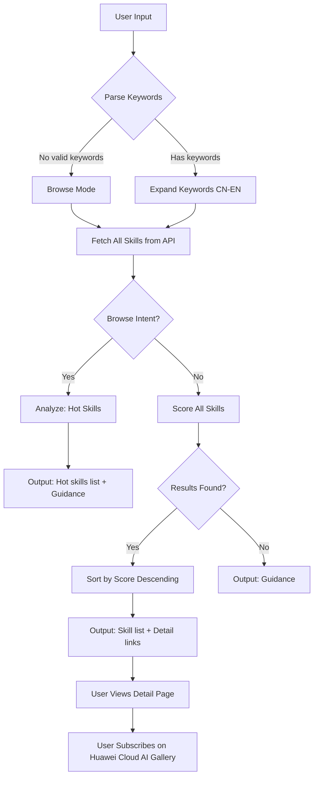
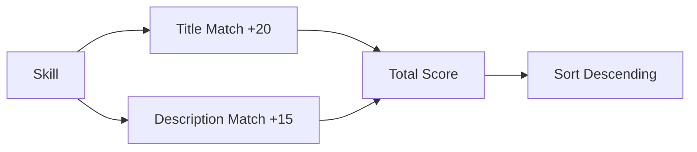
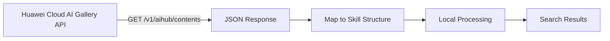

# Data Flow Diagram

## Search Flow

```mermaid
flowchart TD
    A[User Input] --> B{Parse Keywords}
    B -->|No valid keywords| C[Browse Mode]
    B -->|Has keywords| D[Expand Keywords CN-EN]
    
    C --> E[Fetch All Skills from API]
    D --> E
    
    E --> F{Browse Intent?}
    F -->|Yes| G[Analyze: Hot Skills]
    G --> H[Output: Hot skills list + Guidance]
    
    F -->|No| I[Score All Skills]
    I --> J{Results Found?}
    
    J -->|Yes| K[Sort by Score Descending]
    K --> L[Output: Skill list + Detail links]
    
    J -->|No| M[Output: Guidance]
    
    L --> N[User Views Detail Page]
    N --> O[User Subscribes on Huawei Cloud AI Gallery]
```

## Scoring Logic

```mermaid
flowchart LR
    A[Skill] --> B[Title Match +20]
    A --> C[Description Match +15]
    B --> D[Total Score]
    C --> D
    D --> E[Sort Descending]
```

## Data Source

```mermaid
flowchart LR
    A[Huawei Cloud AI Gallery API] -->|GET /v1/aihub/contents| B[JSON Response]
    B --> C[Map to Skill Structure]
    C --> D[Local Processing]
    D --> E[Search Results]
```
