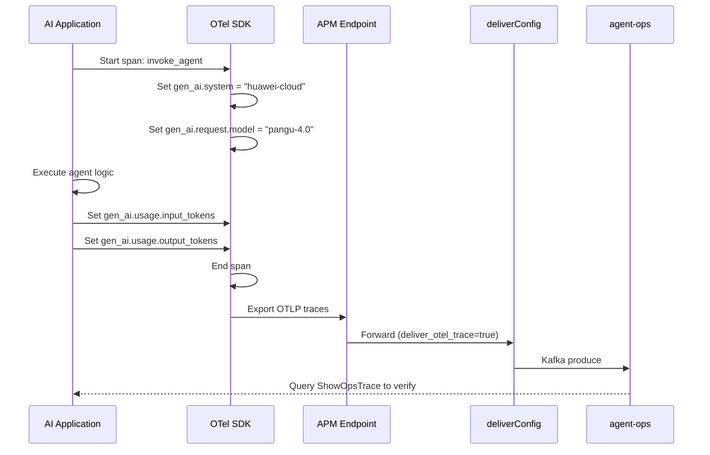

# Data Flow Diagram

## OTel Ingestion Data Flow

```mermaid
flowchart TD
    subgraph Application
        APP[Application\nJava/Python/Node.js/Go]
        OTEL[OTel SDK / Collector]
        APP --> OTEL
    end

    subgraph Path A: APM deliverConfig (Recommended)
        APM[APM OTLP Endpoint]
        DC[deliverConfig\nForwarding]
        KAFKA[Kafka\nSASL_SSL]
        AGENTOPS_MGMT[agent-ops\nManagement Plane]

        OTEL -->|OTLP/HTTP| APM
        APM -->|deliver_otel_trace=true| DC
        DC -->|Produce| KAFKA
        KAFKA -->|Consume| AGENTOPS_MGMT
    end

    subgraph Path B: OTLP Direct (Verification Only)
        COLLECTOR[OTel Collector\nOTLP Receiver]
        OTEL -->|OTLP/gRPC or HTTP| COLLECTOR
        COLLECTOR -->|Direct (if available)| AGENTOPS_MGMT
    end

    subgraph Management Plane Queries
        TRACE_QUERY[ShowOpsTrace\nListOpsTrace]
        SESSION_QUERY[ListOpsSession]
        METRIC_QUERY[ShowOpsAgentMetricTrend\nShowOpsAgentMetricGauge]
        LOG_QUERY[ListOpsAgentLog]

        AGENTOPS_MGMT --> TRACE_QUERY
        AGENTOPS_MGMT --> SESSION_QUERY
        AGENTOPS_MGMT --> METRIC_QUERY
        AGENTOPS_MGMT --> LOG_QUERY
    end

    subgraph AI Agent Observation
        AI_APP[AI/LLM Application]
        GENAI[gen_ai Spans\ngen_ai.system\ngen_ai.request.model\ngen_ai.usage.*]
        AI_APP -->|Instrument| GENAI
        GENAI -->|OTLP| OTEL
    end

    subgraph Setup
        CREATE_BIZ[Create Tracing Business]
        GET_TOKEN[Get Business Token]
        GET_AP[Get Access Point]
        CREATE_DC[Create deliverConfig]

        CREATE_BIZ --> GET_TOKEN
        GET_TOKEN --> GET_AP
        GET_AP --> CREATE_DC
        CREATE_DC --> APM
    end
```

## AI Agent Observation Flow


