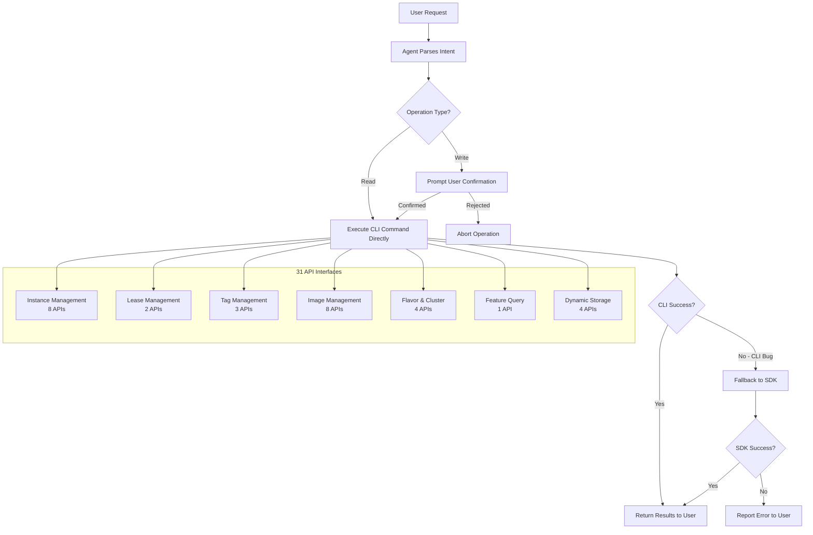
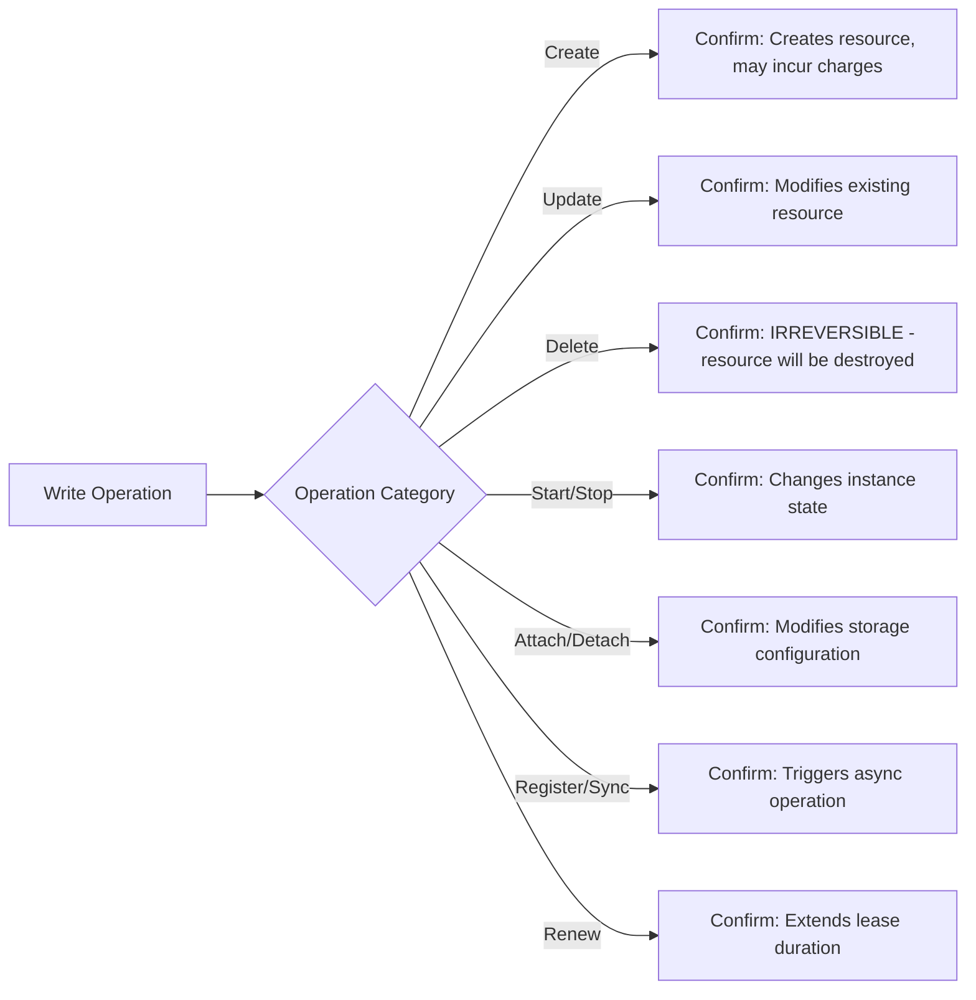

# Data Flow Diagram

```mermaid
graph TD
    A[User Request] --> B[Agent Parses Intent]
    B --> C{Operation Type?}

    C -->|Read| D[Execute CLI Command Directly]
    C -->|Write| E[Prompt User Confirmation]
    E -->|Confirmed| D
    E -->|Rejected| F[Abort Operation]

    D --> G{CLI Success?}
    G -->|Yes| H[Return Results to User]
    G -->|No - CLI Bug| I[Fallback to SDK]
    I --> J{SDK Success?}
    J -->|Yes| H
    J -->|No| K[Report Error to User]

    subgraph "31 API Interfaces"
        L[Instance Management<br/>8 APIs]
        M[Lease Management<br/>2 APIs]
        N[Tag Management<br/>3 APIs]
        O[Image Management<br/>8 APIs]
        P[Flavor & Cluster<br/>4 APIs]
        Q[Feature Query<br/>1 API]
        R[Dynamic Storage<br/>4 APIs]
    end

    D --> L
    D --> M
    D --> N
    D --> O
    D --> P
    D --> Q
    D --> R
```

## Write Operations Requiring Confirmation

```mermaid
graph LR
    A[Write Operation] --> B{Operation Category}
    B -->|Create| C[Confirm: Creates resource, may incur charges]
    B -->|Update| D[Confirm: Modifies existing resource]
    B -->|Delete| E[Confirm: IRREVERSIBLE - resource will be destroyed]
    B -->|Start/Stop| F[Confirm: Changes instance state]
    B -->|Attach/Detach| G[Confirm: Modifies storage configuration]
    B -->|Register/Sync| H[Confirm: Triggers async operation]
    B -->|Renew| I[Confirm: Extends lease duration]
```
