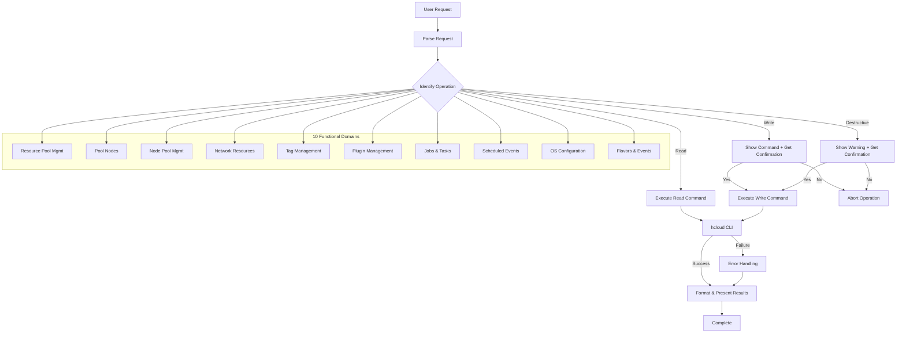
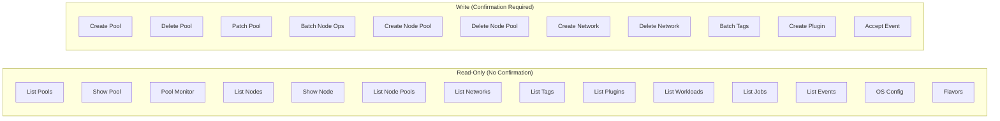

# Data Flow Diagram

## ModelArts Resource Pool Management Data Flow

```mermaid
graph TD
    User[User Request] --> Parse[Parse Request]
    Parse --> Identify{Identify Operation}
    
    Identify -->|Read| ExecuteRead[Execute Read Command]
    Identify -->|Write| ConfirmWrite[Show Command + Get Confirmation]
    Identify -->|Destructive| WarnDestructive[Show Warning + Get Confirmation]
    
    ConfirmWrite -->|Yes| ExecuteWrite[Execute Write Command]
    ConfirmWrite -->|No| Abort[Abort Operation]
    WarnDestructive -->|Yes| ExecuteWrite
    WarnDestructive -->|No| Abort
    
    ExecuteRead --> CLI[ hcloud CLI ]
    ExecuteWrite --> CLI
    
    CLI -->|Success| FormatResult[Format & Present Results]
    CLI -->|Failure| ErrorHandling[Error Handling]
    
    ErrorHandling --> FormatResult
    
    FormatResult --> Done[Complete]
    
    subgraph "10 Functional Domains"
        D1[Resource Pool Mgmt]
        D2[Pool Nodes]
        D3[Node Pool Mgmt]
        D4[Network Resources]
        D5[Tag Management]
        D6[Plugin Management]
        D7[Jobs & Tasks]
        D8[Scheduled Events]
        D9[OS Configuration]
        D10[Flavors & Events]
    end
    
    Identify --> D1
    Identify --> D2
    Identify --> D3
    Identify --> D4
    Identify --> D5
    Identify --> D6
    Identify --> D7
    Identify --> D8
    Identify --> D9
    Identify --> D10
```

## Operation Classification

```mermaid
graph LR
    subgraph "Read-Only (No Confirmation)"
        R1[List Pools]
        R2[Show Pool]
        R3[Pool Monitor]
        R4[List Nodes]
        R5[Show Node]
        R6[List Node Pools]
        R7[List Networks]
        R8[List Tags]
        R9[List Plugins]
        R10[List Workloads]
        R11[List Jobs]
        R12[List Events]
        R13[OS Config]
        R14[Flavors]
    end
    
    subgraph "Write (Confirmation Required)"
        W1[Create Pool]
        W2[Delete Pool]
        W3[Patch Pool]
        W4[Batch Node Ops]
        W5[Create Node Pool]
        W6[Delete Node Pool]
        W7[Create Network]
        W8[Delete Network]
        W9[Batch Tags]
        W10[Create Plugin]
        W11[Accept Event]
    end
```
