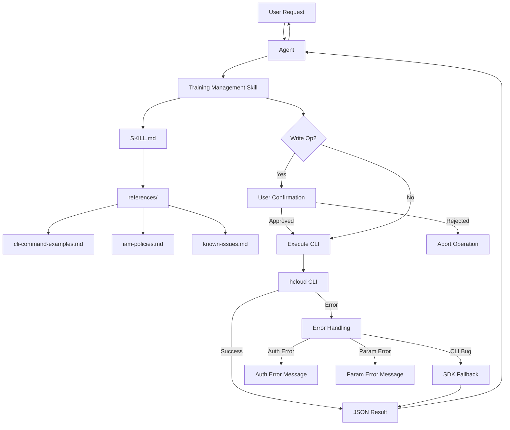
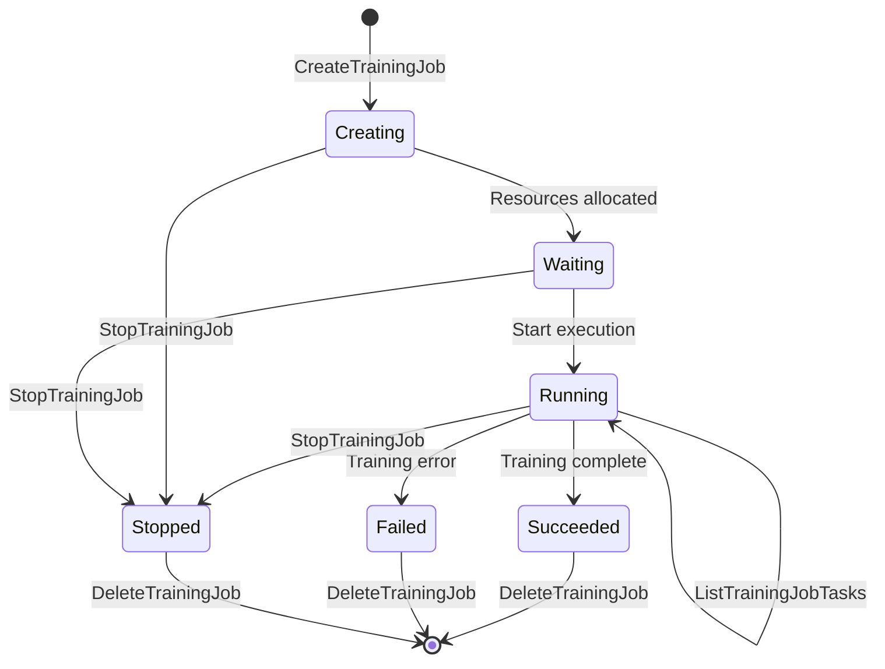
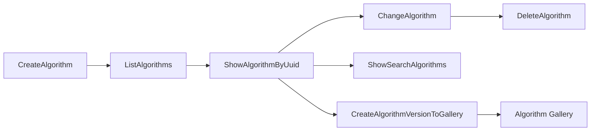
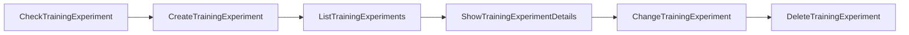
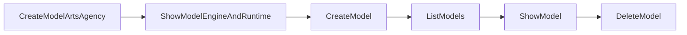
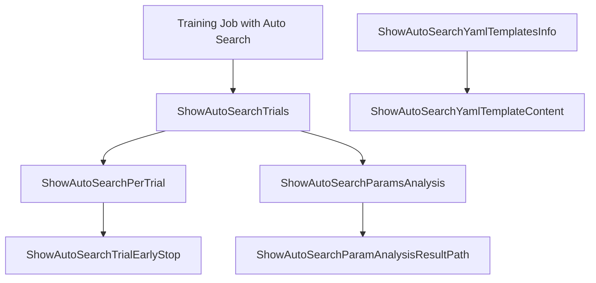
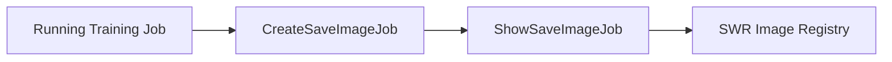
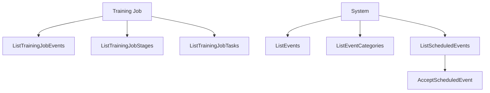

# Data Flow Diagram

> Mermaid diagram showing the data flow for ModelArts training management operations.

---

## Overall Architecture

---

## Training Job Lifecycle

---

## Algorithm Management Flow

---

## Training Experiment Flow

---

## Model Import Flow

---

## Auto Search Flow

---

## Training Image Save Flow

---

## Event Management Flow

