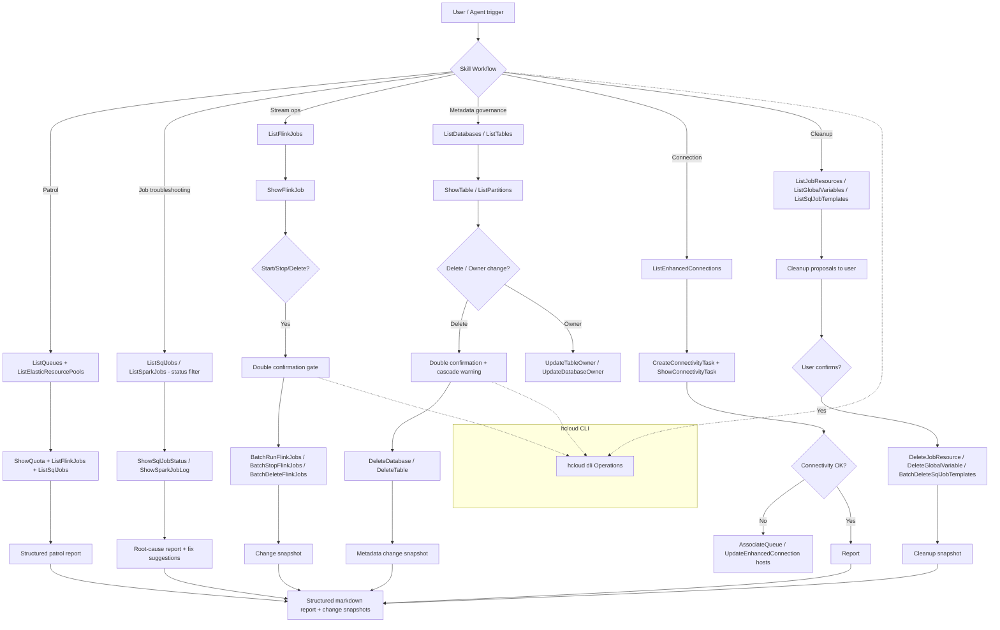

# Data Flow Diagram

```mermaid
flowchart TD
    U[User / Agent trigger] --> W{Skill Workflow}

    W -->|Patrol| P1[ListQueues + ListElasticResourcePools]
    P1 --> P2[ShowQuota + ListFlinkJobs + ListSqlJobs]
    P2 --> P3[Structured patrol report]

    W -->|Job troubleshooting| J1[ListSqlJobs / ListSparkJobs - status filter]
    J1 --> J2[ShowSqlJobStatus / ShowSparkJobLog]
    J2 --> J3[Root-cause report + fix suggestions]

    W -->|Stream ops| F1[ListFlinkJobs]
    F1 --> F2[ShowFlinkJob]
    F2 --> F3{Start/Stop/Delete?}
    F3 -->|Yes| F4[Double confirmation gate]
    F4 --> F5[BatchRunFlinkJobs / BatchStopFlinkJobs / BatchDeleteFlinkJobs]
    F5 --> F6[Change snapshot]

    W -->|Metadata governance| D1[ListDatabases / ListTables]
    D1 --> D2[ShowTable / ListPartitions]
    D2 --> D3{Delete / Owner change?}
    D3 -->|Delete| D4[Double confirmation + cascade warning]
    D4 --> D5[DeleteDatabase / DeleteTable]
    D3 -->|Owner| D6[UpdateTableOwner / UpdateDatabaseOwner]
    D5 --> D7[Metadata change snapshot]

    W -->|Connection| C1[ListEnhancedConnections]
    C1 --> C2[CreateConnectivityTask + ShowConnectivityTask]
    C2 --> C3{Connectivity OK?}
    C3 -->|No| C4[AssociateQueue / UpdateEnhancedConnection hosts]
    C3 -->|Yes| C5[Report]

    W -->|Cleanup| R1[ListJobResources / ListGlobalVariables / ListSqlJobTemplates]
    R1 --> R2[Cleanup proposals to user]
    R2 --> R3{User confirms?}
    R3 -->|Yes| R4[DeleteJobResource / DeleteGlobalVariable / BatchDeleteSqlJobTemplates]
    R4 --> R5[Cleanup snapshot]

    P3 --> OUT[Structured markdown report + change snapshots]
    J3 --> OUT
    F6 --> OUT
    D7 --> OUT
    C5 --> OUT
    R5 --> OUT

    subgraph HCLOUD[hcloud CLI]
        Q[hcloud dli Operations]
    end
    W -.-> Q
    F4 -.-> Q
    D4 -.-> Q
```

All arrows ending in `OUT` produce a structured report with inventory, risks,
and change snapshots; AK/SK is never included in outputs.