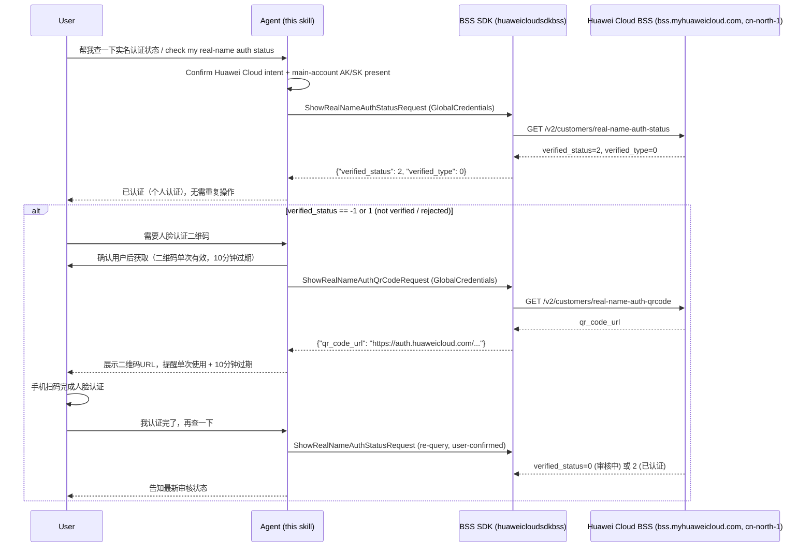
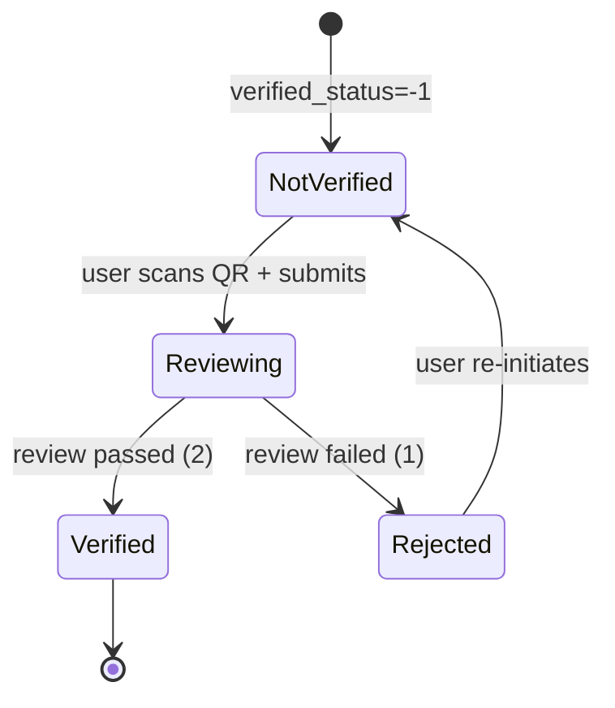
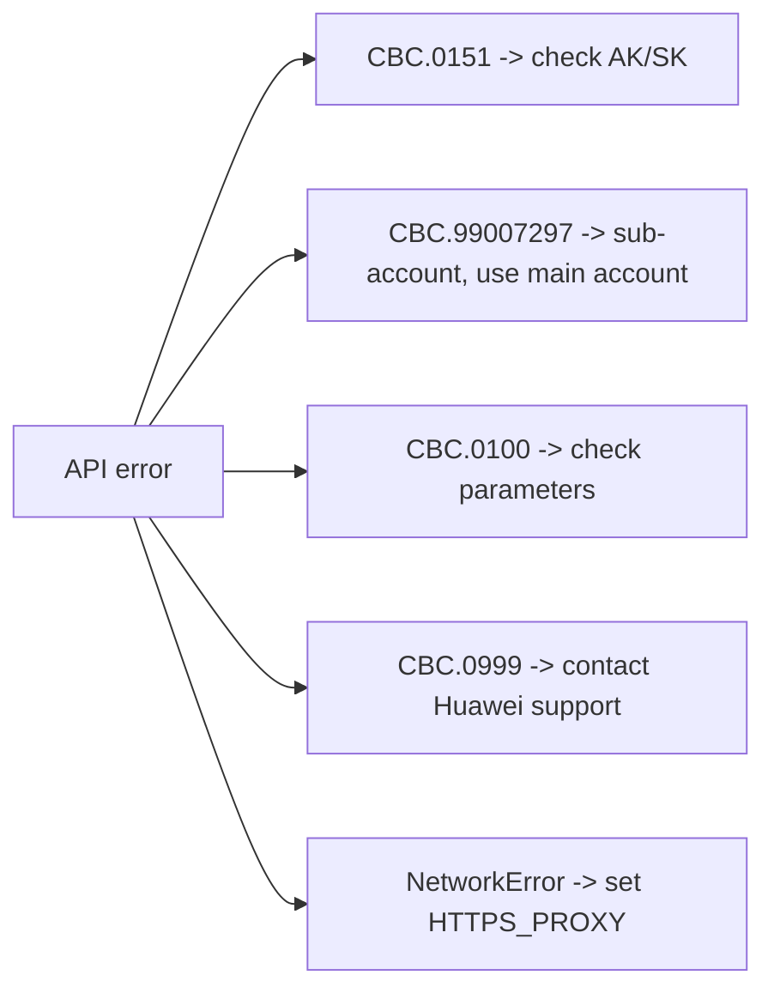

# Dataflow Diagram

## End-to-End Sequence

```mermaid
sequenceDiagram
    participant U as User
    participant A as Agent (this skill)
    participant S as BSS SDK (huaweicloudsdkbss)
    participant H as Huawei Cloud BSS (bss.myhuaweicloud.com, cn-north-1)

    U->>A: 帮我查一下实名认证状态 / check my real-name auth status
    A->>A: Confirm Huawei Cloud intent + main-account AK/SK present
    A->>S: ShowRealNameAuthStatusRequest (GlobalCredentials)
    S->>H: GET /v2/customers/real-name-auth-status
    H-->>S: verified_status=2, verified_type=0
    S-->>A: {"verified_status": 2, "verified_type": 0}
    A-->>U: 已认证（个人认证），无需重复操作

    alt verified_status == -1 or 1 (not verified / rejected)
        U->>A: 需要人脸认证二维码
        A->>U: 确认用户后获取（二维码单次有效，10分钟过期）
        A->>S: ShowRealNameAuthQrCodeRequest (GlobalCredentials)
        S->>H: GET /v2/customers/real-name-auth-qrcode
        H-->>S: qr_code_url
        S-->>A: {"qr_code_url": "https://auth.huaweicloud.com/..."}
        A-->>U: 展示二维码URL，提醒单次使用 + 10分钟过期
        U->>U: 手机扫码完成人脸认证
        U->>A: 我认证完了，再查一下
        A->>S: ShowRealNameAuthStatusRequest (re-query, user-confirmed)
        H-->>S: verified_status=0 (审核中) 或 2 (已认证)
        A-->>U: 告知最新审核状态
    end
```

## Authentication State Machine

```mermaid
stateDiagram-v2
    [*] --> NotVerified: verified_status=-1
    NotVerified --> Reviewing: user scans QR + submits
    Reviewing --> Verified: review passed (2)
    Reviewing --> Rejected: review failed (1)
    Rejected --> NotVerified: user re-initiates
    Verified --> [*]
```

## Error Path

```mermaid
flowchart LR
    E[API error] --> CBC0151[CBC.0151 -> check AK/SK]
    E --> CBC99007297[CBC.99007297 -> sub-account, use main account]
    E --> CBC0100[CBC.0100 -> check parameters]
    E --> CBC0999[CBC.0999 -> contact Huawei support]
    E --> NET[NetworkError -> set HTTPS_PROXY]
```