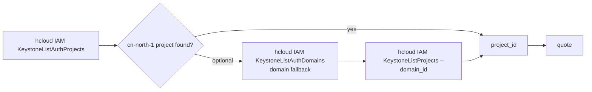

# Data Flow Diagram — Huawei Cloud Cost Estimation

```mermaid
flowchart TD
    U[User intent: 询价/报价/价格/预算/比价] --> P1{Parse}
    P1 -->|extract quadruple + period/usage| CAT[references/semantic/catalog.yml]
    CAT -->|pricing_mode=period| PMOD[rfq-period-model.yml]
    CAT -->|pricing_mode=on_demand| OMOD[rfq-ondemand-model.yml]

    P1 -->|missing required field| C1{Clarify - one round, 2-4 candidates}
    C1 -->|safe-default only| P1

    P1 --> Q{Query - dimension chain}
    Q --> SR[hcloud BSS ListServiceResources<br/>--service_type_code]
    SR --> RS[hcloud BSS ListResourceSpecs<br/>--charge_mode --region_code --filters]
    RS --> UT{on-demand?}
    UT -->|yes| LU[hcloud BSS ListUsageTypes<br/>--resource_type_code]
    LU --> MU[hcloud BSS ListMeasureUnits<br/>Measure Resolve]
    UT -->|no| MU
    MU --> QUOTE

    QUOTE -->|period| PR[hcloud BSS ListRateOnPeriodDetail<br/>dot-notation product_infos.N.*]
    QUOTE -->|on-demand| OD[hcloud BSS ListOnDemandResourceRatings<br/>product_infos.N.* + usage]
    PR --> V1{Verify & Present}
    OD --> V1

    V1 --> SUM[line-item sum = total · CNY · 非最终账单]
    V1 --> |error CBC.99006006 / CBC.6006| ERR[back to spec/region/mode confirm]
    V1 --> |403/CBC.0151| IAM[report read-only Action needed]
    V1 --> |429| RETRY[wait 2s retry once]
    SUM --> OUT[format each line:<br/>[service] [spec] [region] [qty×period] = ¥amount]
```

## Scope resolution (project_id)



## Conventions inside the flow

- BSS commands always `--cli-region=cn-north-1`; deploy region lives in `product_infos.N.region`.
- Quotes are unpaginated; multiple lines in a single request via `product_infos.N.*`, max 100.
- Codes are case-sensitive; take raw values from dimension queries.
- `resource_spec` only from `ListResourceSpecs`; never append OS suffix manually.