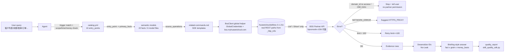

# Data Flow Diagram

## Flow Description

1. **Routing** — SKILL.md gates the provider (Huawei Cloud partner account), then
   `catalog.yml` matches the user's scope/time/money requirement to an entry point.
2. **Fact resolution** — the entry point's `primary_facts` select the model file;
   each fact declares `source_operations`, `grain`, `evidence_boundary`, and
   measure `additivity`.
3. **Execution** — `related-commands.md` provides the copyable SDK template; the
   shared client uses `GlobalCredentials` + fixed endpoint
   `https://bss.myhuaweicloud.com` (region `cn-north-1`).
4. **Guards** — read-only whitelist enforced before execution; error table
   intercepts permission/network/limit failures.
5. **Delivery** — evidence rows are desensitized and summarized; the run reports
   quality telemetry via `scripts/skill_quality_sdk.py` (fail-silent).