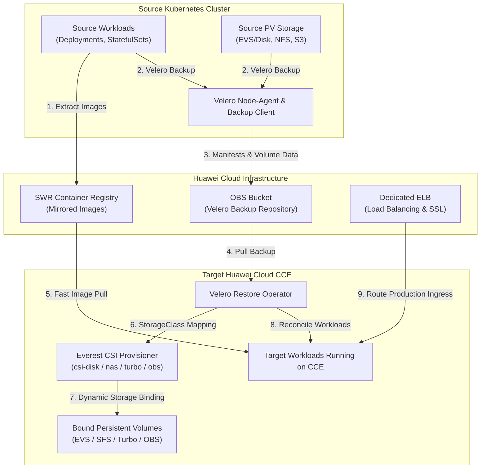
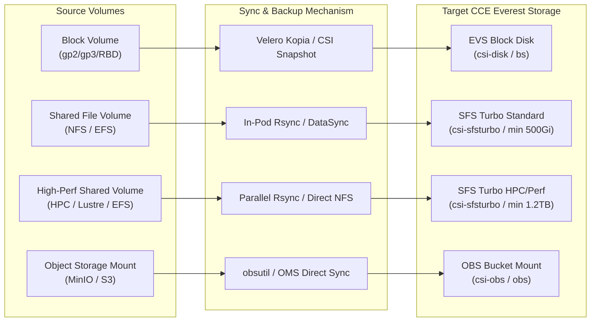
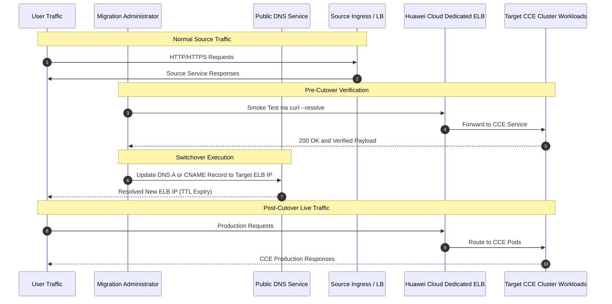

# Data Flow and Architecture Diagrams

This document visualizes the migration workflow, storage replication paths, and traffic cutover mechanics for the `huawei-cloud-cce-cluster-migrator` skill.

---

## 1. End-to-End Migration Flow

---

## 2. Multi-Type PV Storage Migration Matrix

---

## 3. Ingress Traffic Cutover Sequence

