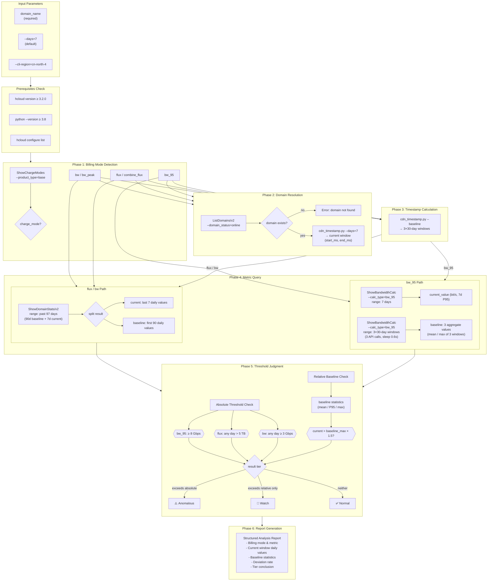

# Data Flow Diagram — CDN Traffic Anomaly Analysis

## Data Flow Summary

| Phase | bw_95 Path | flux / bw Path |
|-------|-----------|----------------|
| **API Calls** | 6 total (1 billing + 1 domain + 1 current + 3 baseline) | 3 total (1 billing + 1 domain + 1 combined 97d query) |
| **Current Window** | 7-day P95 aggregate (single value, bit/s) | Last 7 daily values from 97-day result |
| **Baseline** | 3 × 30-day P95 aggregates → statistics (mean, max) | First 90 daily values from 97-day result → statistics (mean, P95, max) |
| **Rate Limit** | ShowBandwidthCalc: 2/s, 6 calls ≈ 3s | ShowDomainStats: 15/s, no concern |

## Key API Constraints

- **ShowBandwidthCalc**: max 31-day range, single aggregate value (no per-day breakdown). Baseline requires 3 separate 30-day queries.
- **ShowDomainStats/v2**: supports ≥365-day range, returns one data point per day at `interval=86400`. A single 97-day query covers both baseline (first 90 days) and current window (last 7 days).