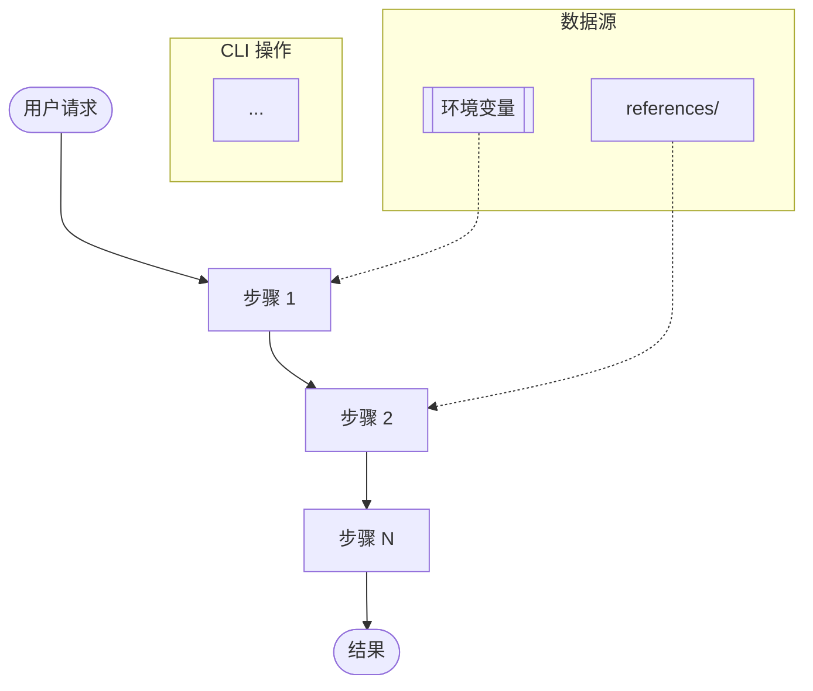

# 华为云 Skill 创建器

> **语言 / Language:** 中文 | [English](../../SKILL.md)

基于 `skill-spec-generic.md` 规范，创建符合华为云标准的 AI Agent Skill。

> **规范文件：** [`references/skill-spec-generic.md`](references/skill-spec-generic.md) — 所有 Skill 必须遵循的完整规范。

## 前置条件

> 首次使用前请阅读 [`references/cli-installation-guide.md`](references/cli-installation-guide.md)。

- CLI 已安装并完成认证配置
- AK/SK 通过环境变量 `HUAWEI_ACCESS_KEY` / `HUAWEI_SECRET_KEY` 获取
- IAM 用户具备所需权限（见 [`references/iam-policies.md`](references/iam-policies.md)）
- 默认区域已配置（如 `cn-north-4`）

## 核心命令

| 命令 | 说明 |
|------|------|
| `hcloud ECS ListServers --cli-region=cn-north-4` | 列出 ECS 实例 |
| `hcloud VPC ListVpcs --cli-region=cn-north-4` | 列出 VPC |
| `hcloud OBS ListBuckets --cli-region=cn-north-4` | 列出 OBS 桶 |
| `hcloud IAM ListUsers --cli-region=cn-north-4` | 列出 IAM 用户 |

## 参数确认

| 参数 | 必需 | 说明 | 示例 |
|------|------|------|------|
| `--cli-region` | 是 | 区域 ID | `cn-north-4` |
| `--project_id` | 否 | 项目 ID | `0a2663967980d2962f94c0120b96c98b` |
| `--limit` | 否 | 最大返回条数 | `10` |
| `--offset` | 否 | 分页偏移 | `0` |

## 概述

Skill 是 AI Agent 的"领域专业知识包"——一个结构化的指令文件夹，让 Agent 在特定任务上具备专业知识和工作流。本 Skill 负责创建符合华为云规范的其他 Skill，确保每个生成的 Skill 都具备完整的目录结构、规范的 SKILL.md、详尽的参考文档和可复用的脚本。

## 设计原则

**原则 1**：每个 Skill 应解决一个具体的 Agent 使用场景。不追求大而全，追求"Agent 正好需要时它能用"。

**原则 2**：Skill 应具备领域完整性。当用户需要该领域能力时，Agent 能在 Skill 内完成全流程，无需频繁跳出。

**原则 3**：Skill 的内容与 Agent 能力是协作关系。Skill 提供专业知识和工作流，Agent 负责推理和执行。

## 创建流程 / 工作流

当用户要求创建新 Skill 时，按以下步骤执行：

### Step 1：需求分析

1. 确认用户要封装的**华为云服务/产品**（如 ECS、VPC、OBS、RDS 等）
2. 确认 Skill 的**功能定位**（管理、诊断、部署、监控等）
3. 确认涉及的**CLI 命令或 API 操作**
4. 确认**触发场景**（什么情况下 Agent 会使用此 Skill）

### Step 2：命名与目录

1. 按 `{platform}-{product}-{function}` 公式生成 Skill 名称
   - platform 固定为 `huawei-cloud`
   - product 为服务缩写（ecs、vpc、obs、rds、iam、cce 等）
   - function 为功能描述（manage、diagnosis-workflow、deploy 等）
   - 示例：`huawei-cloud-ecs-diagnosis-workflow`

2. 确定领域目录（compute / network / storage / database / security / monitoring / middleware / devtools / solution），详见 [`references/naming-conventions.md`](references/naming-conventions.md)

3. 创建目录结构：

```text
{domain}/{skill-name}/
├── SKILL.md                   # 必需：YAML Frontmatter + Markdown 指令
├── references/                # 推荐：参考文档（按需加载）
│   ├── dataflow-diagram.md    # 必需：Mermaid 数据流图
│   ├── cli-installation-guide.md
│   ├── iam-policies.md
│   ├── verification-method.md
│   ├── acceptance-criteria.md
│   └── related-commands.md
├── scripts/                   # 推荐：可执行脚本
│   └── {script-name}
├── templates/                 # 可选：配置/模板文件
│   └── {template-name}
├── i18n/                      # 可选：国际化
│   └── zh-CN/                 # 简体中文
│       ├── SKILL.md
│       ├── references/
│       └── templates/
└── demo/                      # 可选：示例数据
    └── example.json
```

### Step 3：调研 API

Use CLI help flags to discover available operations and parameter definitions (e.g., `ECS --help`, `ECS ListServers --help`).

```bash
# 测试只读操作（幂等，可重复执行）
hcloud ECS ListServers --cli-region={region}
```

如 CLI 未注册对应 API，查阅华为云 OpenAPI 文档获取方法、路径、参数和权限信息。

### Step 4：生成数据流图

每个 Skill **必须**包含一个数据流图，用于可视化数据在 Skill 工作流中的流转方式。该图帮助用户和开发者快速理解 Skill 的运作方式。

**生成方式：**

```bash
bash scripts/generate-dataflow-diagram.sh {skill-path} --output={skill-path}/references/dataflow-diagram.md
```

或使用模板 [`templates/dataflow-diagram.md.template`](templates/dataflow-diagram.md.template) 手动创建。

**图表要求：**
- 使用 **Mermaid** `flowchart` 语法（广泛支持于 Markdown 渲染器）
- 展示从用户输入到最终输出的完整工作流
- 将 CLI 操作作为子图（subgraph）包含
- 将数据源（环境变量、参考文档、脚本）作为子图包含
- 区分主数据流（`-->`）和辅助/引用数据流（`-.->`）
- 提供图例说明符号含义
- 提供数据流描述表（步骤 | 输入 | 处理 | 输出）
- 将图表保存为 `references/dataflow-diagram.md`

**图表结构：**



### Step 5：生成 SKILL.md

使用 [`templates/SKILL.md.template`](templates/SKILL.md.template) 生成，必须包含：

#### 4.1 YAML Frontmatter

```yaml
---
name: {skill-name}
description: |
  {功能定位摘要}. 触发条件包括：{触发1}、{触发2}、{触发3}. {前置条件}.
tags: [{tag1}, {tag2}, ...]
---
```

- `name` 必填，遵循命名公式
- `description` 必填，必须包含 **"触发条件包括："** 子句，列出所有触发场景（如用户操作、关键词、意图），以便 Agent 准确匹配此 Skill
- `tags` 推荐 3-8 个
- `version` 必填，遵循 SemVer（MAJOR.MINOR.PATCH）

#### 4.2 正文结构

| 章节 | 必需 | 内容 |
|------|------|------|
| 概述 | 是 | 背景介绍、Skill 定位 |
| 前置条件 | 推荐 | CLI 安装、AK/SK 配置、IAM 权限 |
| 主要步骤 | 是 | 核心操作流程 + 代码示例 |
| 边界情况 | 推荐 | 常见错误、异常处理 |
| 验证方法 | 推荐 | 操作成功判断标准 |
| 参考文档 | 推荐 | 指向 references/ |
| 脚本使用 | 按需 | scripts/ 说明 |

#### 4.3 编写要求

**内容要求：**
- 每步操作有清晰的 CLI 指令
- 关键参数有配置说明
- 每个操作标注所需权限
- 提供 3-5 个典型使用示例
- 指向 references/ 中的详细文档

**触发条件要求：**
- `description` **必须**包含 `"触发条件包括："` 子句
- 列出所有应激活此 Skill 的用户意图、关键词和短语
- 同时包含中文和英文触发短语（如 "创建 Skill"、"create skill"）
- 触发条件是 Agent 路由的主要机制——需精确编写

**语言要求：**
- 默认 SKILL.md 及 `references/`、`templates/`、`scripts/` 下的内容必须以**英文**为主
- 中文翻译放在 `i18n/zh-CN/` 下，保持相同目录结构
- 英文 SKILL.md 须包含指向 `i18n/zh-CN/SKILL.md` 的语言切换链接（如存在），反之亦然

**安全要求：**
- CLI 参数/脚本中 **不能直接嵌入 AK/SK 等敏感信息**
- 敏感信息通过环境变量或安全配置获取
- 示例中的账号信息使用占位符 `{placeholder}`
- 正文建议 500 行以内

### Step 6：生成 references/

| 文件 | 必需 | 内容 |
|------|------|------|
| `dataflow-diagram.md` | 是 | Skill 工作流的 Mermaid 数据流图 |
| `cli-installation-guide.md` | 推荐 | CLI 安装与初始化步骤 |
| `iam-policies.md` | 是 | 所需 API Action + 最小权限策略 JSON |
| `verification-method.md` | 推荐 | 操作验证方法 |
| `acceptance-criteria.md` | 推荐 | 验收标准 |
| `related-commands.md` | 按需 | 命令速查表 |

使用 [`templates/iam-policies.md.template`](templates/iam-policies.md.template) 和 [`templates/cli-installation-guide.md.template`](templates/cli-installation-guide.md.template) 生成。

**扩展参考文件（按需）：**

| 文件名 | 适用场景 |
|--------|----------|
| `related-apis.md` | 操作项多时使用 |
| `generic-diagnostics-workflow.md` | 多步骤诊断场景 |
| `service-catalog.md` | 涉及多服务交互时 |
| `parameter-format.md` | 有特殊参数格式要求 |
| `common-workflows.md` | 有不同的操作模式 |
| `cli-troubleshooting.md` | CLI 使用中可能有问题 |
| `region-and-spec.md` | 依赖区域/规格差异 |
| `search-commands.md` | 需要快速查找命令 |

**参考文件编写要求：**
- 每个 ref 文件专注解决一个问题，不混合内容
- 文件头部加简短说明，明确何时需要读取此文件
- 大文件（>300 行）顶部加目录
- 引用信息保持与平台文档一致
- 占位符使用花括号标识（如 `{instance_id}`）
- 代码块标注语言类型

### Step 7：生成 scripts/（按需）

**脚本类型：**

| 类型 | 用途 | 示例 |
|------|------|------|
| 分析脚本 | 解析 CLI 输出做自动化分析 | `analyze-ingress-offline.sh` |
| 部署脚本 | 编排多步 CLI 操作 | `deploy-folder.mjs` |
| 数据处理 | CLI JSON 输出处理 | `get_logs.py` |
| 工具库 | 公共函数复用 | `credentials.py`, `validation.py` |

**脚本编写要求：**
1. 脚本使用有意义的名称，以功能命名
2. Shell 脚本加 `#!/bin/bash`，Python 加 `#!/usr/bin/env python3`
3. 脚本中不能硬编码 AK/SK 等敏感信息，通过环境变量获取
4. 脚本兼容对应 CLI 的多版本
5. 脚本提供参数校验和错误处理
6. Python 脚本所在目录需有 `__init__.py`
7. Node.js 脚本使用 `.mjs` 后缀，使用 ES Module

### Step 8：生成 templates/ 和 demo/（按需）

- `templates/`：配置模板（IaC 模板如 Terraform/CloudFormation、API 请求 JSON/YAML 模板、报告/通知 Markdown 模板）
- `demo/`：示例数据（示例请求/响应、示例配置文件、测试用数据）

### Step 9：质量验证

使用 [`../../scripts/validate-skill.sh`](../../scripts/validate-skill.sh) 验证：

```bash
bash ../../scripts/validate-skill.sh {skill-path}
```

验证项详见 [`references/quality-checklist.md`](references/quality-checklist.md) 和 [`references/acceptance-criteria.md`](references/acceptance-criteria.md)。

## 华为云 CLI 命令格式

```bash
# 通用格式
hcloud ECS ListServers --cli-region=cn-north-4 --param1=value1 --param2=value2

# 具体示例
hcloud ECS ListServers --cli-region=cn-north-4

# 幂等操作（可重复执行）
hcloud ECS ShowServer --cli-region=cn-north-4 --server_id={instance_id}

# 嵌套参数
hcloud ECS CreateServers --cli-region=cn-north-4 --os-start.servers.1.id={id1}
```

| 特性 | 说明 | 示例 |
|------|------|------|
| 服务名 | 大写 PascalCase | `ECS`, `VPC`, `IAM` |
| 操作名 | PascalCase | `ListServers`, `ShowServer` |
| 区域参数 | `--cli-region=<value>` | `--cli-region=cn-north-4` |
| 简单参数 | `--key=value` | `--server_id=xxx` |
| 索引参数 | `--key.1=value1` | `--servers.1.id=xxx` |
| 嵌套参数 | `--key.sub_key=value` | `--config.protocol=vnc` |

## 安全操作规范

**必须遵守：**
- 敏感信息（AK/SK）通过环境变量获取，而非明文参数
- 创建/修改/删除操作前确认用户意图
- 优先使用只读查询（List/Describe/Get）验证环境状态
- 高危操作前使用预览模式（`--dry-run`）

**必须避免：**
- 在命令中明文展示敏感凭证
- 无确认执行破坏性操作
- 使用过期的 API 版本
- 忽略错误码和返回状态

## User-Agent 标识

在生成的 Skill 的 CLI 调用中添加 User-Agent 标识，便于平台追踪 Skill 使用情况：

```bash
# 如果 CLI 支持 --user-agent 参数
hcloud ECS ListServers --cli-region=cn-north-4 --user-agent HuaweiCloud-Agent-Skills

# 如果 CLI 支持环境变量
export HCLOUD_USER_AGENT=HuaweiCloud-Agent-Skills
```

## 认证与安全

### 认证方式

| 认证方式 | 适用场景 | 推荐做法 |
|----------|----------|----------|
| AK/SK 环境变量 | 开发环境 | 设置 `HUAWEI_ACCESS_KEY` / `HUAWEI_SECRET_KEY` 环境变量 |
| 临时令牌 | 生产环境 | 使用 STS 临时 AK/SK + SecurityToken |
| IAM 角色 | 云上运行 | 绑定 IAM 角色自动获取权限 |

### CLI 配置流程

```bash
# 通过环境变量设置默认区域
export HUAWEI_REGION=cn-north-4
```

> **安全提醒：** 不要在脚本中硬编码 AK/SK。使用环境变量或 IAM 角色。禁止通过 CLI 配置命令传入明文凭据。

### 权限策略要求

每个生成的 Skill 的 `references/iam-policies.md` 中必须：
1. 定义所需权限（查询操作和操作类操作分表列出）
2. 提供最小权限策略 JSON
3. 标注需要 MFA 等高安全要求操作

## 版本管理

### 版本号规范

遵循 SemVer：`MAJOR.MINOR.PATCH`

| 版本位 | 含义 | 何时递增 | 示例 |
|--------|------|----------|------|
| MAJOR | 不兼容变更 | API 版本变更、破坏性更新 | `1.x.x` → `2.0.0` |
| MINOR | 向后兼容的功能新增 | 新增功能、新增操作 | `2.0.x` → `2.1.0` |
| PATCH | 向后兼容的问题修复 | 文档修正、Bug 修复 | `2.1.0` → `2.1.1` |

版本号记录在 SKILL.md 的 YAML Frontmatter 的 `version` 字段中。

### 分支策略

| 分支 | 用途 | 说明 |
|------|------|------|
| `main` | 稳定发布 | 经过测试验证的正式版本 |
| `preview` | 预览/Beta | 提前预览新功能 |
| `{skill-name}-{version}` | 版本发布 | 特定版本快照 |

### 安装方式

```bash
# 通过包管理器安装
npx skills add https://gitcode.com/developer-skill/developer-skill.git --skill {skill-name}

# 本地安装
git clone https://gitcode.com/developer-skill/developer-skill.git
npx skills add ./skills/{domain}/{skill-name}
```

## 开发工作流

### 完整开发流程

```text
需求理解 → 编写草稿 → 创建测试用例 →
同时运行 with-skill / without-skill →
编排断言 → 评分 →
用户审查输出 → 根据反馈改进 → 重复迭代
```

### 迭代原则

- 每次改进后重新运行所有测试
- 用迭代标记（iteration-N）追踪版本演进
- 当用户反馈全为空（都满意）或不再有显著改进时停止
- 从测试中识别重复工作，提取为 scripts/ 中的脚本
- 阅读运行日志，不仅看最终输出——识别 Agent 在低效环节消耗时间的模式

### 发布流程

1. 代码合并到 `main` 分支
2. 更新 SKILL.md 版本号
3. 运行 `validate-skill.sh` 确保通过
4. 打 tag 发布

### 废弃策略

- 废弃的 API 操作在 SKILL.md 中标注
- 废弃的 Skill 在 description 中声明 deprecated
- 提供迁移到新版本的指引

## 测试与评估

### 测试类型

| 类型 | 方法 | 目标 |
|------|------|------|
| 基础校验 | 结构检查 | Frontmatter 和目录结构 |
| 功能测试 | 运行测试用例 | 验证功能正确性 |
| 对比测试 | with/without-skill | 量化 Skill 增值效果 |
| 回归测试 | 迭代间对比 | 确保改进不引入回退 |
| 触发测试 | trigger eval set | 优化 description 准确率 |

### 评估指标

| 指标 | 说明 |
|------|------|
| pass_rate | 断言通过率 |
| time_seconds | 执行耗时 |
| tokens | Token 消耗 |
| delta | with/without 差异值 |

## 贡献指南

### Issue 规范

| 标签 | 用途 |
|------|------|
| `bug` | 功能异常、命令错误 |
| `feature` | 新增 Skill、扩展能力 |
| `documentation` | SKILL.md 优化 |
| `security` | 权限、凭证问题 |
| `question` | 用法咨询 |

### PR 规范

- 每个 PR 只解决一个问题
- PR 标题格式：`[type] description`
- 提交前运行 `validate-skill.sh`
- 更新对应的版本号

## 数据流图

本 Skill 自身的数据流图，展示 Skill 创建请求如何在工作流中流转：

```mermaid
flowchart TD
  INPUT([/"用户：创建华为云 Skill"/])
  STEP1["Step 1：需求分析"]
  STEP2["Step 2：命名与目录"]
  STEP3["Step 3：调研 API"]
  STEP4["Step 4：生成数据流图"]
  STEP5["Step 5：生成 SKILL.md"]
  STEP6["Step 6：生成 references/"]
  STEP7["Step 7：生成 scripts/"]
  STEP8["Step 8：生成 templates/ & demo/"]
  STEP9["Step 9：质量验证"]
  OUTPUT([/"完整 Skill 包"/])

  subgraph CLI_OPS["CLI 操作"]
    CLI_OP1["hcloud {Service} --help"]
    CLI_OP2["hcloud {Service} List{Resources}"]
    CLI_OP3["hcloud {Service} {Operation} --help"]
  end

  subgraph DATA["数据源"]
    ENV[/"环境变量\nHUAWEI_ACCESS_KEY, HUAWEI_SECRET_KEY, HUAWEI_REGION"/]
    REFS["references/\nskill-spec-generic.md, naming-conventions.md"]
    TEMPLATES["templates/\nSKILL.md.template, dataflow-diagram.md.template"]
    SCRIPTS["scripts/\ngenerate-dataflow-diagram.sh, validate-skill.sh"]
  end

  INPUT --> STEP1
  STEP1 --> STEP2
  STEP2 --> STEP3
  STEP3 --> STEP4
  STEP4 --> STEP5
  STEP5 --> STEP6
  STEP6 --> STEP7
  STEP7 --> STEP8
  STEP8 --> STEP9
  STEP9 --> OUTPUT

  ENV -.-> STEP1
  REFS -.-> STEP2
  TEMPLATES -.-> STEP5
  SCRIPTS -.-> STEP4
  SCRIPTS -.-> STEP9

  STEP3 --> CLI_OPS
  CLI_OP1 -.-> STEP3
  CLI_OP2 -.-> STEP3
  CLI_OP3 -.-> STEP5
```

### 数据流描述

| 步骤 | 输入 | 处理 | 输出 |
|------|------|------|------|
| 1. 需求分析 | 用户请求 + 环境配置 | 确认服务、范围、触发条件 | 结构化需求 |
| 2. 命名与目录 | 需求 + 命名规范 | 按公式生成名称，创建目录结构 | Skill 目录路径 |
| 3. 调研 API | 目录 + CLI 访问 | 通过 --help 发现操作，测试只读命令 | API 操作列表 |
| 4. 生成数据流图 | 工作流步骤 + CLI 操作 | 从模板生成 Mermaid 图 | `references/dataflow-diagram.md` |
| 5. 生成 SKILL.md | API 列表 + 模板 | 用服务数据填充 SKILL.md.template | `SKILL.md` |
| 6. 生成 references/ | SKILL.md + API 数据 | 创建 iam-policies、cli-guide 等 | `references/` 目录 |
| 7. 生成 scripts/ | 工作流需求 | 创建分析/部署脚本 | `scripts/` 目录 |
| 8. 生成 templates/ & demo/ | 配置模式 | 创建 IaC/API 模板 + 示例 | `templates/` + `demo/` |
| 9. 质量验证 | 完整 skill 目录 | 运行 validate-skill.sh | 验证报告 |

## 典型使用场景

### 场景 1：创建 ECS 管理 Skill

```text
用户: 帮我创建一个华为云 ECS 管理的 Skill
Agent: 
  1. 确认功能：ECS 实例的查询、创建、启停、删除
  2. 命名：huawei-cloud-ecs-manage
  3. 领域：compute
  4. 通过 CLI help 调研 ECS 操作
  5. 数据流图：为 ECS 工作流生成 Mermaid 数据流图
  6. 生成 compute/huawei-cloud-ecs-manage/SKILL.md + references/ + scripts/
  7. 运行 validate-skill.sh 验证
```

### 场景 2：创建 OBS 诊断 Skill

```text
用户: 我需要一个 OBS 存储桶诊断的 Skill
Agent:
  1. 确认功能：OBS 桶状态检查、访问日志分析、容量监控
  2. 命名：huawei-cloud-obs-diagnosis-workflow
  3. 领域：storage
  4. 通过 CLI help 调研 OBS 操作
  5. 数据流图：为 OBS 诊断工作流生成 Mermaid 数据流图
  6. 生成 storage/huawei-cloud-obs-diagnosis-workflow/ 完整目录
  7. 运行 validate-skill.sh 验证
```

### 场景 3：创建 VPC 管理 Skill

```text
用户: 创建 VPC 网络管理的 Skill
Agent:
  1. 确认功能：VPC/子网/安全组的查询与配置
  2. 命名：huawei-cloud-vpc-manage
  3. 领域：network
  4. 通过 CLI help 调研 VPC 操作
  5. 数据流图：为 VPC 管理工作流生成 Mermaid 数据流图
  6. 生成 network/huawei-cloud-vpc-manage/ 完整目录
  7. 运行 validate-skill.sh 验证
```

## 关键原则

- **规范优先** — 所有生成的 Skill 必须符合 `references/skill-spec-generic.md`
- **description 决定触发** — `description` 必须包含 `"触发条件包括："` 子句，列出所有触发短语（中文+英文），确保 Agent 精准路由
- **英文为主** — 默认 SKILL.md 使用英文；中文翻译放在 `i18n/zh-CN/` 下
- **安全第一** — AK/SK 不硬编码，写入操作前确认，高危操作 dry-run
- **领域完整** — Skill 内完成全流程，不频繁跳出
- **最小权限** — iam-policies.md 提供最小权限策略 JSON，查询/操作分表列出，标注 MFA
- **幂等优先** — 优先使用 List/Show/Get 等只读操作验证状态
- **User-Agent** — CLI 调用中添加 User-Agent 标识便于追踪
- **版本管理** — 遵循 SemVer，记录在 Frontmatter version 字段
- **数据流图** — 每个 Skill 必须在 `references/dataflow-diagram.md` 中包含 Mermaid 数据流图，展示完整工作流

## i18n

| 语言 | 路径 |
|------|------|
| 简体中文（默认） | `i18n/zh-CN/SKILL.md` |
| English | [`../../SKILL.md`](../../SKILL.md) |

## 参考文档

- [`references/skill-spec-generic.md`](references/skill-spec-generic.md) — 完整规范
- [`references/naming-conventions.md`](references/naming-conventions.md) — 命名规范速查
- [`references/quality-checklist.md`](references/quality-checklist.md) — 质量检查清单
- [`references/acceptance-criteria.md`](references/acceptance-criteria.md) — 验收标准
- [`references/verification-method.md`](references/verification-method.md) — 验证方法
- [`references/related-commands.md`](references/related-commands.md) — 命令速查
- [`references/dataflow-diagram.md`](references/dataflow-diagram.md) — 数据流图（本 Skill 自身的数据流图）
- [`templates/dataflow-diagram.md.template`](templates/dataflow-diagram.md.template) — 数据流图模板
