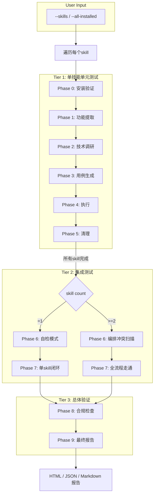
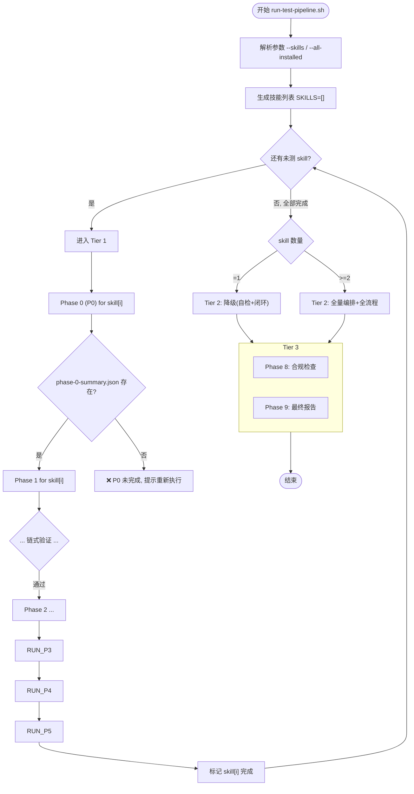

# 三轨九阶架构图



---

## Phase 间链式依赖

```
Phase 0 → Phase 1 → Phase 2 → Phase 3 → Phase 4 → Phase 5
                                                        ↓
                                              ┌───────────────────┐
                                              │   Phase 6 → Phase 7  │
                                              └───────────────────┘
                                                        ↓
                                              ┌───────────────────┐
                                              │   Phase 8 → Phase 9  │
                                              └───────────────────┘
```

## 批量 skill 遍历流程


