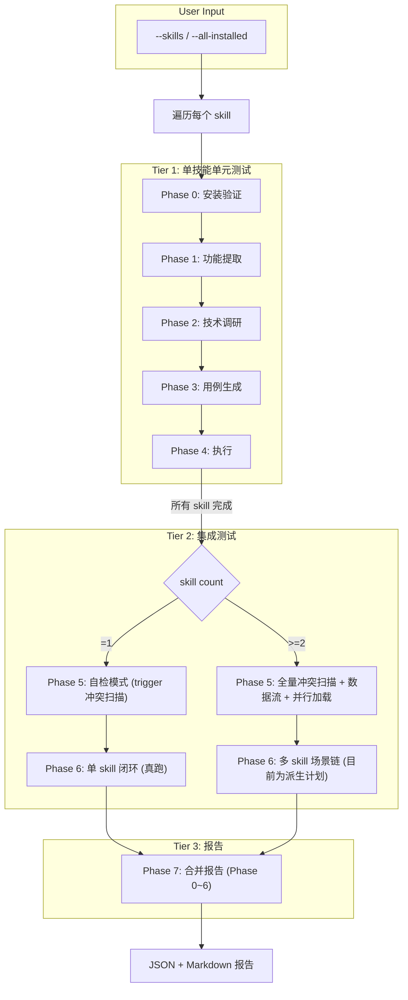
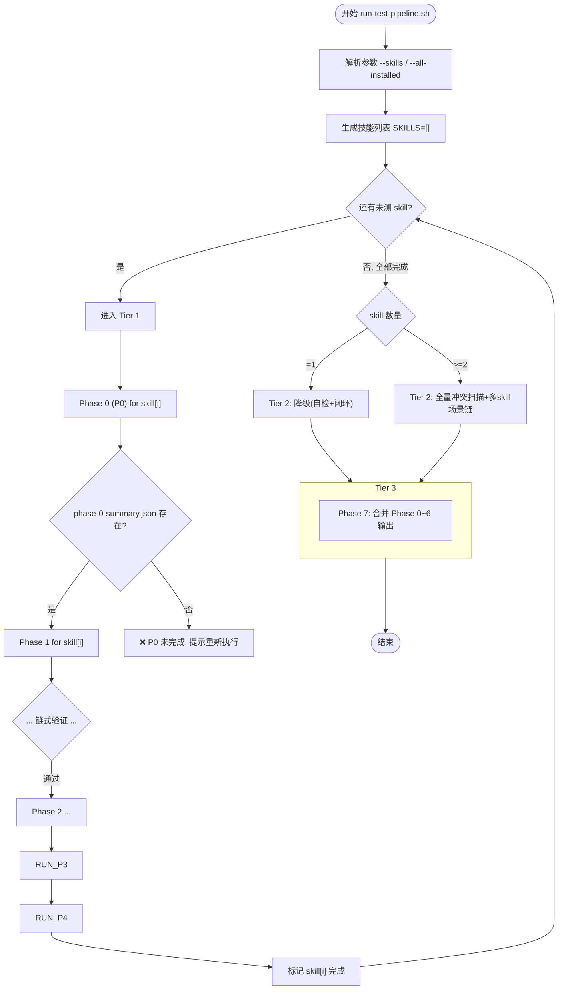

# 三轨八节架构图

> 与 `scripts/` 实际脚本对齐。**三轨 = 单技能单元 / 集成 / 报告**；**八节 = Phase 0~6 七个执行 phase + Phase 7 终报告**。
> 旧版"三轨九阶（含 Phase 8 合规 / Phase 9 终报告）"已废弃：相关脚本未实现，按"不补缺失模块"原则删除。
> 旧表述"三轨七阶（Phase 0~6）"已统一为"三轨八节（Phase 0~7）"。


```mermaid
graph TB
    subgraph "User Input"
        A[--skills / --all-installed]
    end

    subgraph "Tier 1: 单技能单元测试"
        P0["Phase 0: 安装验证"]
        P1["Phase 1: 功能提取"]
        P2["Phase 2: 技术调研"]
        P3["Phase 3: 用例生成"]
        P4["Phase 4: 执行"]
    end

    subgraph "Tier 2: 集成测试"
        direction TB
        DECIDE{"skill count"}
        DECIDE -->|"=1"| P5_SELF["Phase 5: 自检模式 (trigger 冲突扫描)"]
        DECIDE -->|">=2"| P5_FULL["Phase 5: 全量冲突扫描 + 数据流 + 并行加载"]
        P5_SELF --> P6_SELF["Phase 6: 单 skill 闭环 (真跑)"]
        P5_FULL --> P6_FULL["Phase 6: 多 skill 场景链 (目前为派生计划)"]
    end

    subgraph "Tier 3: 报告"
        P7["Phase 7: 合并报告 (Phase 0~6)"]
    end

    A --> Tier1_Loop["遍历每个 skill"]
    Tier1_Loop --> P0 --> P1 --> P2 --> P3 --> P4
    P4 -->|"所有 skill 完成"| DECIDE
    P6_SELF --> P7
    P6_FULL --> P7
    P7 --> OUTPUT["JSON + Markdown 报告"]
```

---

## Phase 间链式依赖

```
Phase 0 → Phase 1 → Phase 2 → Phase 3 → Phase 4 → Phase 5
                                                      ↓
                                            ┌───────────────────┐
                                            │   Phase 5 → Phase 6  │
                                            └───────────────────┘
                                                      ↓
                                            ┌───────────────────┐
                                            │   Phase 6 → Phase 7  │
                                            └───────────────────┘
```

具体的前置依赖矩阵见 `phase-transition-rules.md`。

## 批量 skill 遍历流程


```mermaid
flowchart TD
    START(["开始 run-test-pipeline.sh"])
    START --> PARSE["解析参数 --skills / --all-installed"]
    PARSE --> SKILL_LIST["生成技能列表 SKILLS=[]"]
    SKILL_LIST --> LOOP{"还有未测 skill?"}
    LOOP -->|"是"| TIER1_ENTRY["进入 Tier 1"]
    TIER1_ENTRY --> RUN_P0["Phase 0 (P0) for skill[i]"]
    RUN_P0 --> CHECK_P0{"phase-0-summary.json 存在?"}
    CHECK_P0 -->|"是"| RUN_P1["Phase 1 for skill[i]"]
    CHECK_P0 -->|"否"| FAIL_P0["❌ P0 未完成, 提示重新执行"]
    RUN_P1 --> CHECK_P1{"... 链式验证 ..."}
    CHECK_P1 -->|"通过"| RUN_P2["Phase 2 ..."]
    RUN_P2 --> RUN_P3
    RUN_P3 --> RUN_P4
    RUN_P4 --> MARK_DONE["标记 skill[i] 完成"]
    MARK_DONE --> LOOP

    LOOP -->|"否, 全部完成"| DECIDE_SKILL_COUNT{"skill 数量"}
    DECIDE_SKILL_COUNT -->|"=1"| TIER2_SINGLE["Tier 2: 降级(自检+闭环)"]
    DECIDE_SKILL_COUNT -->|">=2"| TIER2_FULL["Tier 2: 全量冲突扫描+多skill场景链"]

    TIER2_SINGLE --> TIER3
    TIER2_FULL --> TIER3

    subgraph TIER3 ["Tier 3"]
        P7["Phase 7: 合并 Phase 0~6 输出"]
    end

    TIER3 --> END(["结束"])
```
