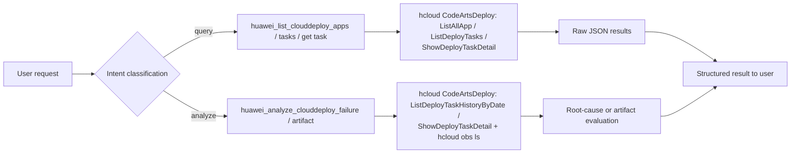
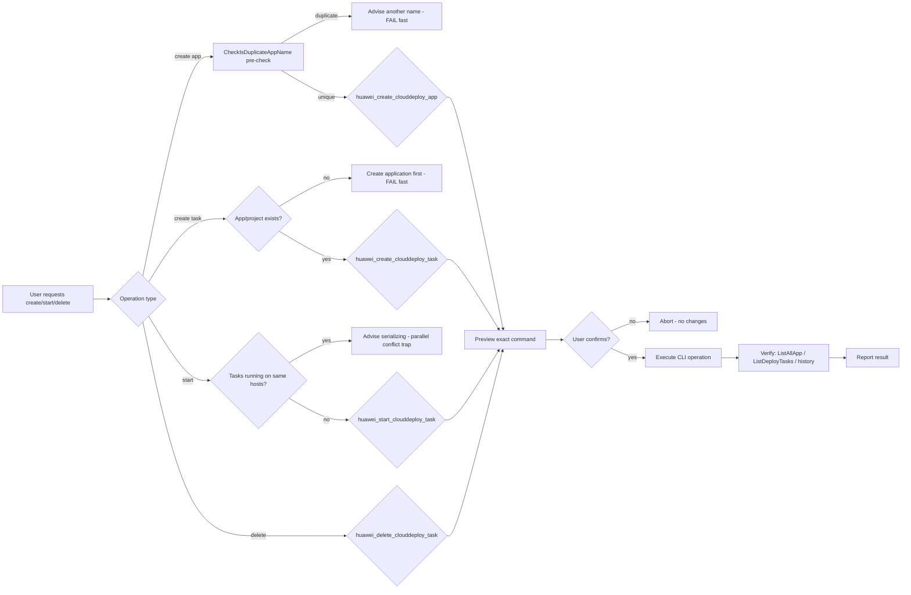
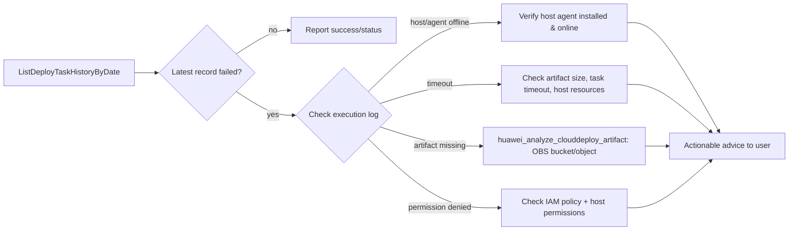

# Data Flow Diagram — huawei-cloud-deployment-task-management

## 1. Query & Analyze Flow (R3 — automatic execution)



## 2. Application & Task Lifecycle (manage — R2/R1, preview + confirm)



## 3. Failure Root-Cause Analysis



## 4. Artifact Link Verification

```mermaid
flowchart LR
    A[ShowDeployTaskDetail] --> B{Artifact source}
    B -->|OBS| C[Parse bucket + object path]
    C --> D[hcloud obs ls obs://bucket/object]
    D -->|object exists| E[Artifact OK]
    D -->|missing| F[Advise re-upload or fix task path]
    D -->|access denied| G[Check bucket policy + GetObject permission]
    B -->|other source| H[Advise checking the configured source]