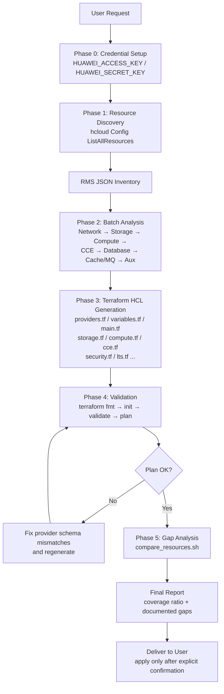

# Data Flow Diagram

## Description

1. **Discovery** — `query_all_resources.sh` calls the RMS `ListAllResources` API once per region and stores the full inventory as JSON.
2. **Analysis** — resources are grouped by service layer and analyzed in dependency order (VPC → storage → ECS → CCE → GaussDB → DCS/DMS → KMS/LTS).
3. **Generation** — Terraform HCL files are written layer by layer; only top-level resources are managed; AK/SK never appears in `.tf` files.
4. **Validation** — `validate_terraform.sh` runs `terraform fmt`, `init`, `validate`, and `plan`; schema mismatches are fixed iteratively.
5. **Gap analysis** — `compare_resources.sh` compares the plan's resource list against the RMS inventory and reports coverage plus documented gaps.