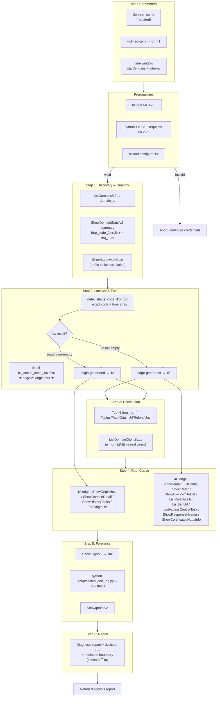

# Data Flow Diagram — CDN Abnormal Status Code Analysis

## Data Flow Summary

| Phase | Command | Input | Output |
|-------|---------|-------|--------|
| Discovery | `ListDomains/v2` + `ShowDomainStats summary` + `ShowBandwidthCalc` | domain_name, window | domain_id, 4xx/5xx totals + ratio, bandwidth peak |
| Localize & fork | `ShowDomainStats detail status_code_*` + `bs_status_code_*` | domain_name, window | exact code, time array, edge/origin verdict |
| Distribution | Top-N + `ListDomainClientStats` | domain_name, window | top IPs/paths/UA, ip_num |
| Root cause | `ShowDomainFullConfig` / `ShowOriginHost` / `ShowDomainDetail` / `ShowHistoryTasks` … | domain_name / domain_id | config state, origin config, refresh history |
| Forensics | `ShowLogs/v2` + `fetch_cdn_log.py` + `ShowIpInfo/v2` | domain_name, link, IPs | per-request abnormal rows JSON, IP attribution |
| Report | — | all above | structured text report |

## Key Constraints

- **Read-only**: every action is a query (GET statistics / GET config / GET log
  link / read-only log download); no write/delete operations.
- **Edge/origin fork** is the backbone: `bs_status_code_*` empty ⇒ edge; non-empty
  ⇒ origin. All downstream root-cause steps branch on this.
- **Credential security**: do not read/echo/print AK/SK; the log helper accepts
  no credentials (it only consumes a presigned link).
- **Region**: use `--cli-region=cn-north-1` (CDN does not support `cn-north-4`).
