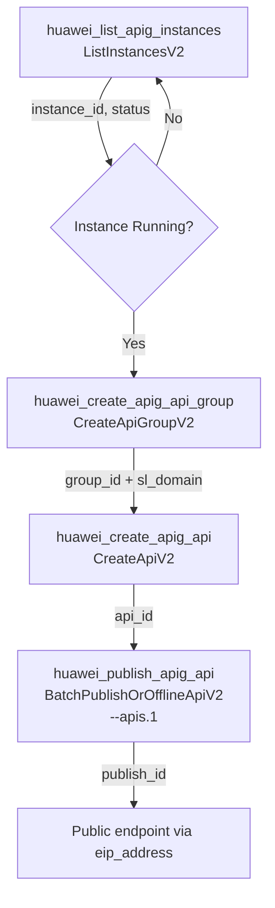
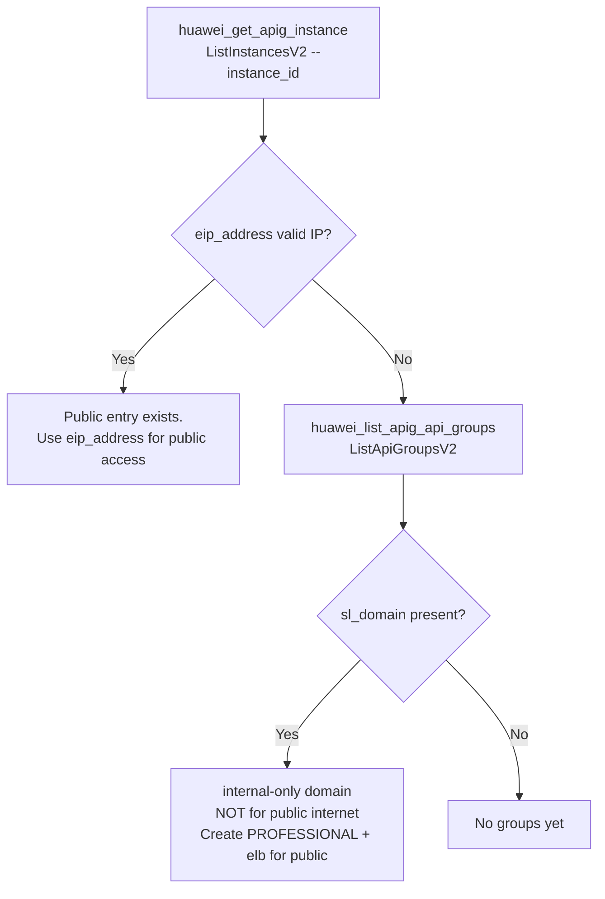
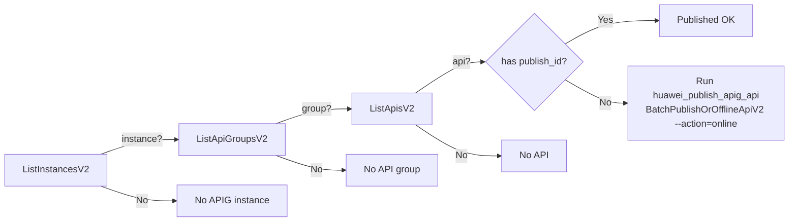

# Data Flow Diagrams

## 1. Lifecycle: instance -> group -> API -> publish



## 2. Public access analysis



## 3. Instance creation (async polling)

```mermaid
sequenceDiagram
    participant A as Agent
    participant C as hcloud CLI
    A->>C: CreateInstanceV2 (spec_id, vpc, subnet, sg, AZ)
    C-->>A: 202 accepted (job started)
    loop every 60s
        A->>C: ListInstancesV2 --instance_id
        C-->>A: status (Creating / CreateSuccess / Running / ...)
    end
    Note over A: stop when status == "Running"<br/>(NOT "SUCCESS" / "CreateSuccess")
    A->>C: AddIngressEipV2 (optional, elb provider)
    A->>C: ListInstancesV2 → eip_address MAY stay null > 8 min;<br/>confirm via AddIngressEipV2 response / retry / cloud EIP list
```

## 4. Publish chain diagnosis

