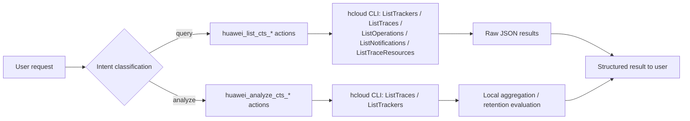
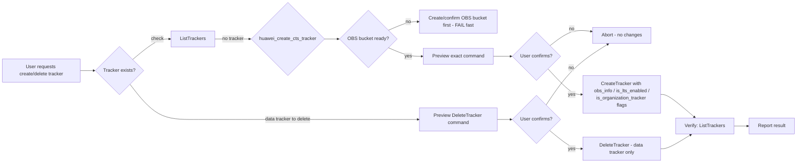
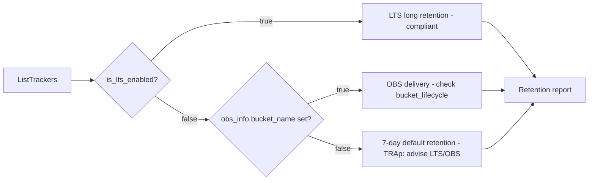

# Data Flow Diagram — huawei-cloud-cts-trace-management

## 1. Query & Analyze Flow (R3 — automatic execution)

## 2. Tracker Lifecycle (manage — R2/R1, preview + confirm)

## 3. Retention & Compliance Analysis

> **Organization tracker:** if org-level cross-account auditing is requested, the tracker must be
> created with `--is_organization_tracker=true`; a normal tracker only covers the current account.