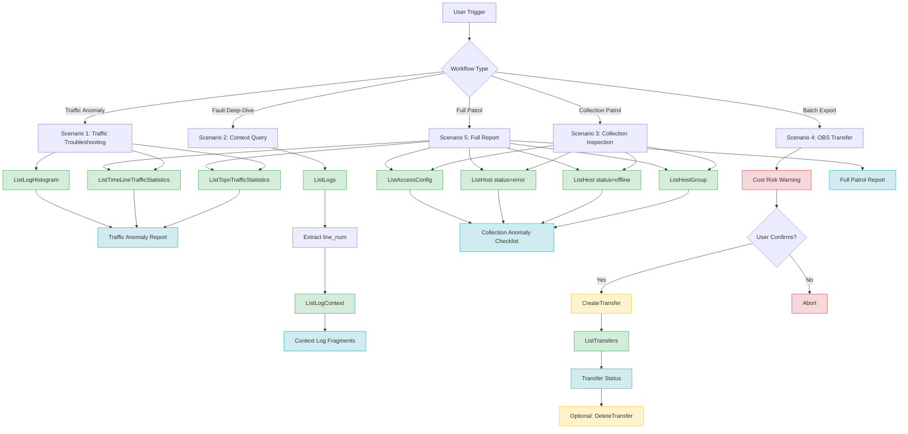

# Data Flow Diagram

## Mermaid Data Flow

## Data Flow Description

| Flow | Input | Processing | Output |
|------|-------|-----------|--------|
| Traffic Stats | Time range, resource type | TOP-N + Timeline + Histogram queries | Structured traffic briefing |
| Context Query | Log group, stream, line_num | ListLogs -> ListLogContext | Concise log fragments |
| Collection Patrol | Host group filter | ListHostGroup + ListHost + ListAccessConfig | Anomaly checklist |
| OBS Transfer | Log group, stream, OBS bucket | CreateTransfer -> ListTransfers | Transfer task status |
| Full Patrol | Time range | All queries aggregated | Complete patrol report |
