# Data Flow Diagram

```mermaid
graph TD
    User[User Request] --> Skill[LTS Management Skill]

    Skill --> Q{Operation Type}

    Q -->|Query| Query[Query Operations]
    Q -->|Create| Create[Create Operations]
    Q -->|Update| Update[Update Operations]
    Q -->|Delete| Delete[Delete Operations]
    Q -->|Diagnose| Diagnose[Log Search / Diagnose]

    Query --> Q1[ListLogGroups]
    Query --> Q2[ListLogStreams]
    Query --> Q3[ListLogStreamIndex]
    Query --> Q4[ListTransfers]
    Query --> Q5[ListKeywordsAlarmRules]
    Query --> Q6[ListSqlAlarmRules]
    Query --> Q7[ListActiveOrHistoryAlarms]

    Diagnose --> D1[ListLogs - keyword search]
    Diagnose --> D2[ListLogContext - context view]
    Diagnose --> D3[ListLogHistogram - distribution]
    Diagnose --> D4[ListQueryStructuredLogs - SQL search]

    Create --> C1[CreateLogGroup]
    Create --> C2[CreateLogStream]
    Create --> C3[CreateLogStreamIndex]
    Create --> C4[CreateTransfer]
    Create --> C5[CreateKeywordsAlarmRule]
    Create --> C6[CreateSqlAlarmRule]

    Update --> U1[UpdateLogGroup - TTL]
    Update --> U2[UpdateLogStream - TTL/storage]
    Update --> U3[UpdateTransfer]
    Update --> U4[UpdateKeywordsAlarmRule]
    Update --> U5[UpdateAlarmRuleStatus]

    Delete --> DL1[DeleteLogGroup ⚠️]
    Delete --> DL2[DeleteLogStream ⚠️]
    Delete --> DL3[DeleteTransfer ⚠️]
    Delete --> DL4[DeleteKeywordsAlarmRule ⚠️]
    Delete --> DL5[DeleteSqlAlarmRule ⚠️]

    Q1 --> HCLOUD[hcloud CLI]
    Q2 --> HCLOUD
    Q3 --> HCLOUD
    Q4 --> HCLOUD
    Q5 --> HCLOUD
    Q6 --> HCLOUD
    Q7 --> HCLOUD
    D1 --> HCLOUD
    D2 --> HCLOUD
    D3 --> HCLOUD
    D4 --> HCLOUD
    C1 --> HCLOUD
    C2 --> HCLOUD
    C3 --> HCLOUD
    C4 --> HCLOUD
    C5 --> HCLOUD
    C6 --> HCLOUD
    U1 --> HCLOUD
    U2 --> HCLOUD
    U3 --> HCLOUD
    U4 --> HCLOUD
    U5 --> HCLOUD
    DL1 --> CONFIRM{User Confirm?}
    DL2 --> CONFIRM
    DL3 --> CONFIRM
    DL4 --> CONFIRM
    DL5 --> CONFIRM

    CONFIRM -->|Yes| HCLOUD
    CONFIRM -->|No| REJECT[Operation Cancelled]

    HCLOUD --> LTS_API[LTS Service API]
    LTS_API --> Result[JSON Response]
    Result --> Output[Output to User]
```

## Flow Description

1. User issues a request (query, create, update, delete, or diagnose)
2. Skill determines the operation type and selects the appropriate hcloud CLI command
3. For Delete operations, user confirmation is required before execution
4. hcloud CLI calls the LTS service API
5. Results are returned as JSON and presented to the user
6. For mutations (Create/Update/Delete), a resource config snapshot is returned
