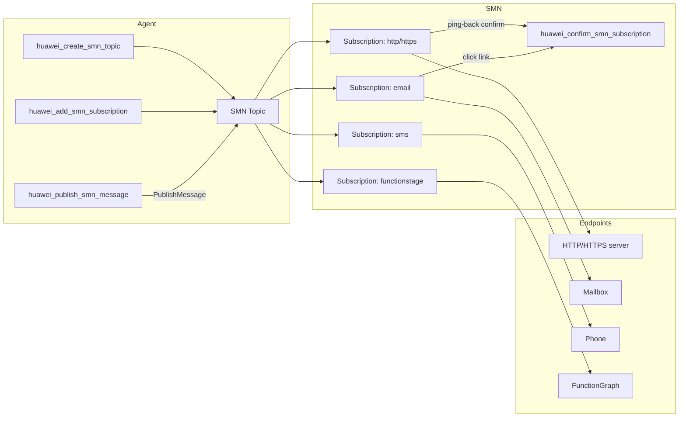
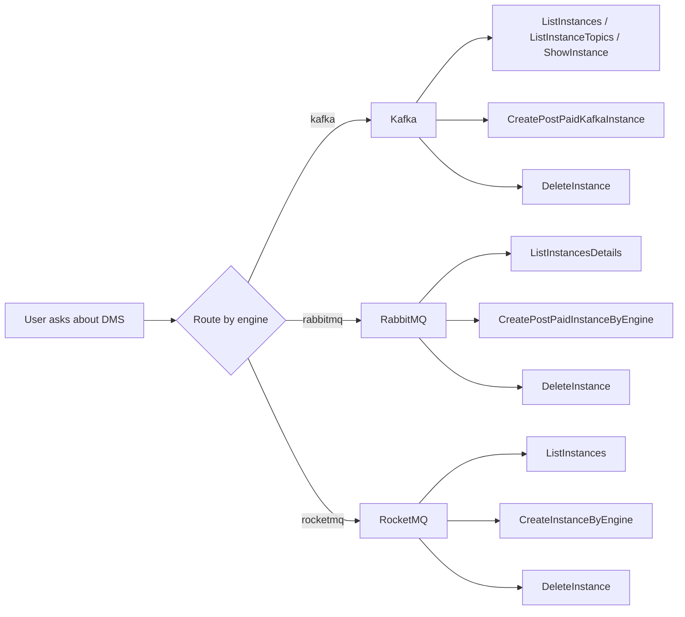
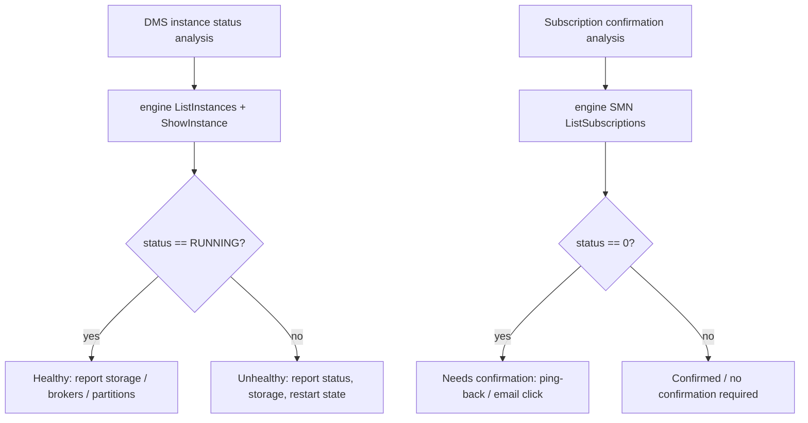

# Data Flow Diagram

## SMN flow — notification publish

```mermaid
flowchart LR
    subgraph Agent
      A[huawei_create_smn_topic] --> T[SMN Topic]
      A2[huawei_add_smn_subscription] --> T
      A3[huawei_publish_smn_message] -->|PublishMessage| T
    end
    subgraph SMN
      T --> S1[Subscription: http/https]
      T --> S2[Subscription: email]
      T --> S3[Subscription: sms]
      T --> S4[Subscription: functionstage]
      S1 -->|ping-back confirm| C[huawei_confirm_smn_subscription]
      S2 -->|click link| C
    end
    subgraph Endpoints
      S1 --> H[HTTP/HTTPS server]
      S2 --> M[Mailbox]
      S3 --> P[Phone]
      S4 --> F[FunctionGraph]
    end
```

## DMS flow — engine-routed instance management

```mermaid
flowchart LR
    U[User asks about DMS] --> E{Route by engine}
    E -->|kafka| K[Kafka]
    E -->|rabbitmq| R[RabbitMQ]
    E -->|rocketmq| Q[RocketMQ]
    K --> KL["ListInstances / ListInstanceTopics / ShowInstance"]
    K --> KC[CreatePostPaidKafkaInstance]
    K --> KD[DeleteInstance]
    R --> RL[ListInstancesDetails]
    R --> RC[CreatePostPaidInstanceByEngine]
    R --> RD[DeleteInstance]
    Q --> QL[ListInstances]
    Q --> QC[CreateInstanceByEngine]
    Q --> QD[DeleteInstance]
```

## Diagnostics flow — R3 auto-analysis

```mermaid
flowchart TD
    Diag[DMS instance status analysis] --> List[engine ListInstances + ShowInstance]
    List --> st{status == RUNNING?}
    st -->|yes| ok[Healthy: report storage / brokers / partitions]
    st -->|no| bad[Unhealthy: report status, storage, restart state]

    Sub[Subscription confirmation analysis] --> LSub[engine SMN ListSubscriptions]
    LSub --> s0{status == 0?}
    s0 -->|yes| need[Needs confirmation: ping-back / email click]
    s0 -->|no| doneok[Confirmed / no confirmation required]
```
