# Data Flow Diagram

```mermaid
flowchart TD
    User[User / Agent] -->|1. ListCentralNetworks| CN[List Central Networks]
    CN -->|returns list| User

    User -->|2. ShowCentralNetwork| CND[Central Network Detail]
    CND -->|returns detail + embedded connections| User

    User -->|3. ListCentralNetworkAttachments| ATT[List Attachments]
    ATT -->|returns attachments with type info| User

    User -->|4a. ShowCentralNetworkErRouteTableAttachment| ERATT[ER Route Table Attachment Detail]
    ERATT -->|returns detail| User

    User -->|4b. ShowCentralNetworkGdgwAttachment| GDGWATT[GDGW Attachment Detail]
    GDGWATT -->|returns detail| User

    User -->|5. ListCentralNetworkConnections| CONN[List Connections]
    CONN -->|returns connections list| User

    User -->|6. ListCentralNetworkConnections --id.1| CONN_SINGLE[Single Connection via ID filter]
    CONN_SINGLE -->|returns single connection| User

    style CN fill:#e1f5fe
    style CND fill:#e1f5fe
    style ATT fill:#e1f5fe
    style ERATT fill:#fff3e0
    style GDGWATT fill:#fff3e0
    style CONN fill:#e1f5fe
    style CONN_SINGLE fill:#fff3e0
```

## Query Flow Description

1. **List Central Networks** — Get all central network instances in the account. Use filters (name, id, enterprise project) to narrow results.

2. **Show Central Network** — Get detailed information for a specific central network. The response includes embedded `connections` array, providing connection info without a separate call.

3. **List Attachments** — Get all attachments for a central network. Each attachment has a type (`GDGW` or `ER_ROUTE_TABLE`).

4. **Show Attachment (by type)** — Based on the attachment type from step 3, use the corresponding type-specific show command:
   - `ER_ROUTE_TABLE` → `ShowCentralNetworkErRouteTableAttachment`
   - `GDGW` → `ShowCentralNetworkGdgwAttachment`

5. **List Connections** — Get all connections for a central network. Supports filters (state, cross-region, bandwidth type).

6. **Show Single Connection** — No dedicated show API; use `ListCentralNetworkConnections` with `--id.1` filter, or read from the `ShowCentralNetwork` embedded `connections` array.
