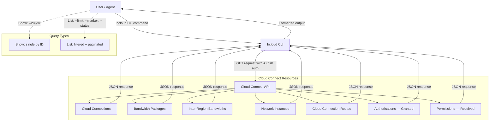
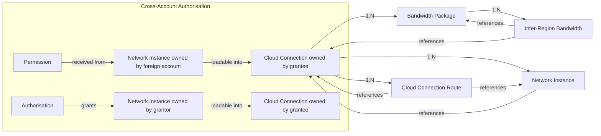

# Data Flow Diagram

## Resource Relationships

## Query Flow

1. **Single query** — User provides `--domain_id` + `--id` → API returns one resource detail
2. **List query** — User provides `--domain_id` + optional filters → API returns paginated list
3. **Pagination** — User provides `--marker` from previous response to get next page
4. **Authorisation audit** — `ListAuthorisations` shows what this account granted; `ListPermissions` shows what this account received. Cross-reference `cloud_connection_domain_id` (in authorisations) or `instance_domain_id` (in permissions) to identify the other party.
