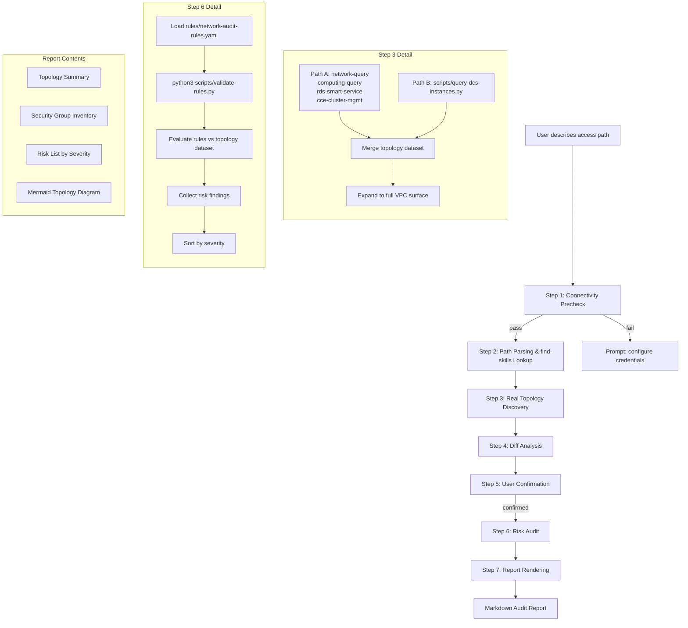

# Data Flow Diagram



## Data Sources

| Source | Type | Tool/Method |
|--------|------|-------------|
| VPC/Subnet/SG/ELB/EIP/NAT | Path A query skill | huawei-cloud-network-query |
| ECS/NIC | Path A query skill | huawei-cloud-computing-query |
| RDS | Path A query skill | huawei-cloud-rds-smart-service |
| CCE | Path A query skill | huawei-cloud-cce-cluster-management |
| DCS | Path B SDK script | scripts/query-dcs-instances.py |
| Rules | Static file | rules/network-audit-rules.yaml |

## Output Flow

```
Topology Dataset (.json internal)
    │
    ├── Diff Engine → Diff List
    ├── Audit Engine → Risk List (sorted by severity)
    └── Report Engine → Markdown Report
                        ├── Topology Summary
                        ├── Security Group Inventory
                        ├── Risk List
                        └── Mermaid Diagram
```