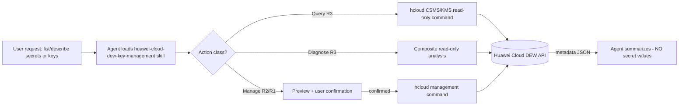
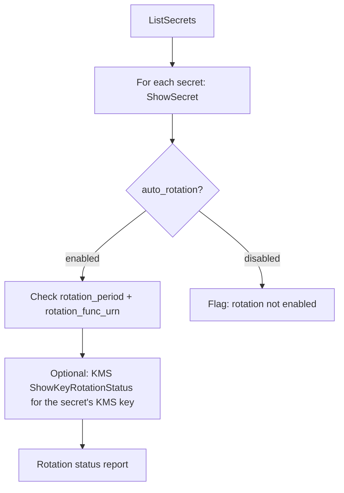
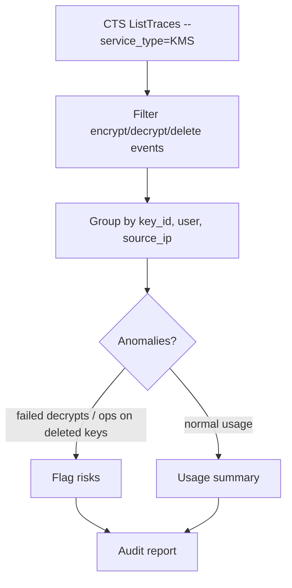

# Data Flow Diagram — huawei-cloud-dew-key-management

## 1. Query flow (R3 — read-only, auto execute)



## 2. Security boundary — secret values never enter agent context

```mermaid
flowchart LR
    subgraph Agent side
        A[Agent context]
        B[BLOCKED: DownloadSecretBlob / ShowSecretVersion value / DecryptData]
    end
    subgraph Runtime side
        C[Application runtime]
        D[{{resolve:csms:secret-id:SecretString:key}}]
        E[(CSMS secret store)]
    end
    A -.->|never| E
    C -->|resolve at deploy| D --> E
    E -->|value injected at runtime only| C
```

## 3. Rotation analysis flow (huawei_analyze_dew_rotation)



## 4. Key usage audit flow (huawei_analyze_dew_key_usage)

