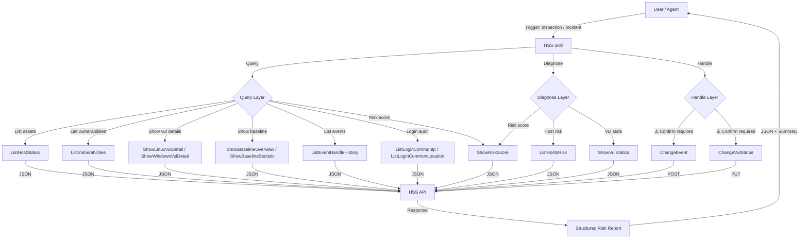

# Data Flow Diagram

## Flow Description

1. **Query Layer** — Read-only operations: list hosts, vulnerabilities, baselines, events, login logs, risk scores
2. **Diagnose Layer** — Risk analysis: aggregate risk scores, host risk status, vulnerability statistics
3. **Handle Layer** — Mutating operations: update alert handling status (requires explicit user confirmation)
4. **Output** — All results aggregated into a structured JSON risk report with readable summary
