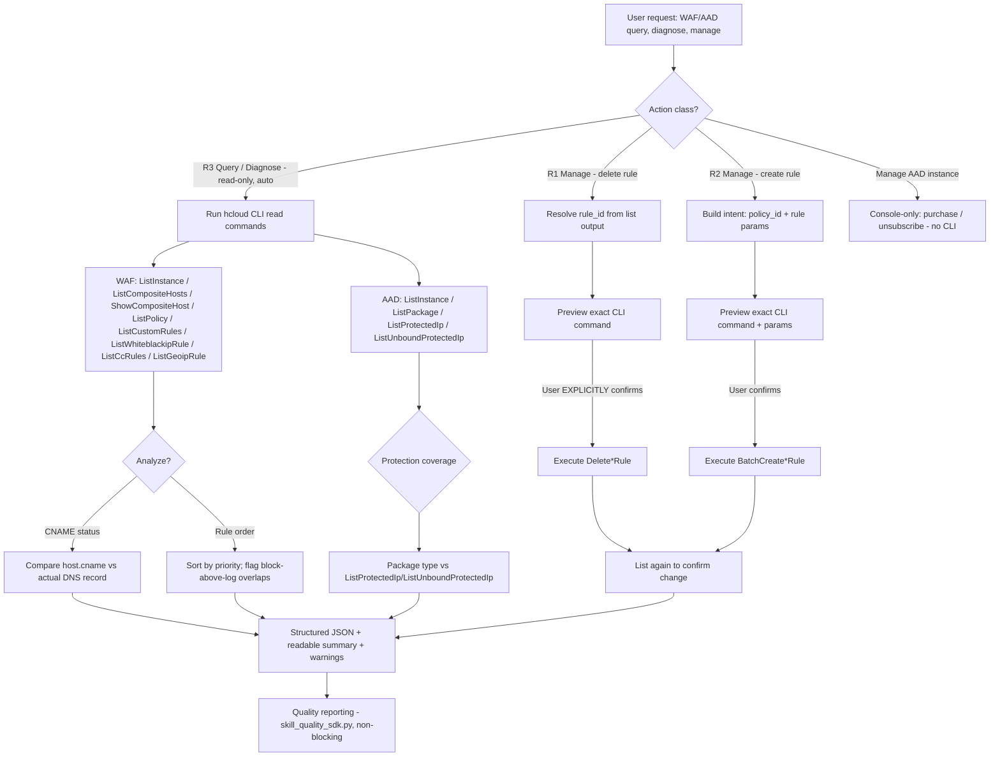

# Data Flow Diagram — huawei-cloud-waf-aad-rule-management

## Description

1. **R3 path (auto)**: read-only `hcloud WAF` / `hcloud AAD` commands run without confirmation.
   Diagnostics combine list/show outputs with external facts (DNS CNAME records, package type
   semantics) to produce warnings.
2. **R2 path (create)**: the rule intent is compiled into the exact `BatchCreate*` command,
   previewed to the user, and executed only after confirmation. New rules default to action=2
   (log / report-only) unless the user explicitly requests blocking.
3. **R1 path (delete)**: the `rule_id` is resolved first, the exact `Delete*Rule` command is
   previewed, and execution requires an explicit "yes, delete".
4. **AAD instance management**: no CLI exists (verified). Routing goes to console guidance only.
5. Every executed action is verified by re-listing resources; results are reported via the
   quality SDK (fail-silent).
