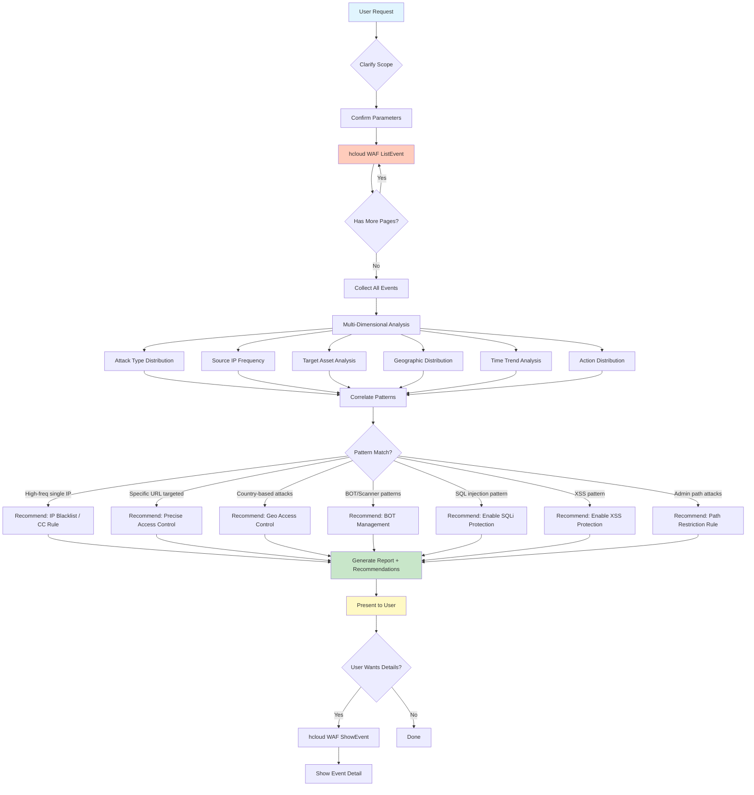

# Data Flow Diagram



## Data Sources

| Stage | Data Source | Fields Used |
|-------|-------------|-------------|
| Query | `ListEvent` API | sip, host, url, attack, action, attack_time, ip_country, ip_region, rule_id, payload |
| Detail | `ShowEvent` API | Full request headers, payload content, matched rule, response action |

## Aggregation Dimensions

```
Events[] → GroupBy(attack)     → Count per type
Events[] → GroupBy(sip)       → Top-N IPs
Events[] → GroupBy(host)      → Most targeted domains
Events[] → GroupBy(url)       → Most targeted paths
Events[] → GroupBy(ip_country) → Geographic distribution
Events[] → GroupBy(action)    → Block/pass/captcha ratio
Events[] → BucketBy(time)     → Hourly/daily trend
```
