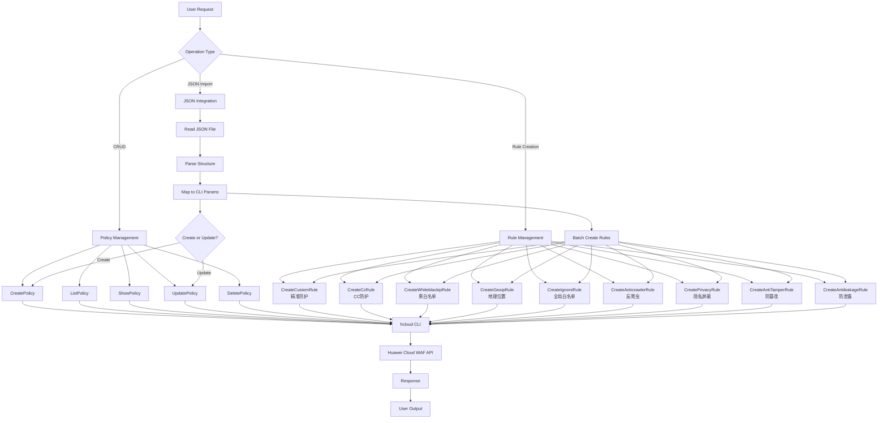
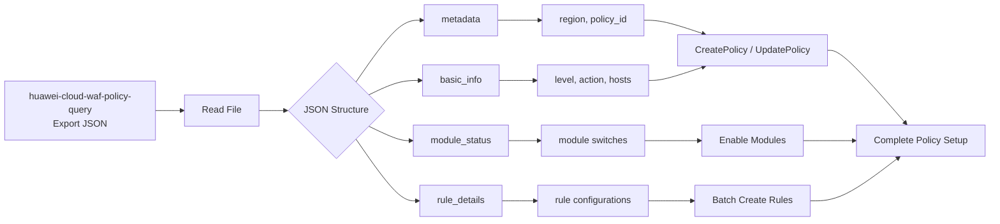

# Data Flow Diagram

## WAF Policy Management Workflow

## JSON Import Flow

## Legend

| Symbol | Meaning |
|--------|---------|
| `[ ]` | Process step |
| `{ }` | Decision point |
| `-->` | Data flow |
