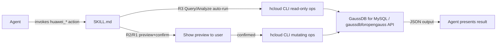

# Huawei Cloud GaussDB Distributed Database

> Manage and diagnose Huawei Cloud GaussDB — covering both the MySQL-compatible engine
> (GaussDB for MySQL) and the openGauss-based distributed engine (GaussDB for openGauss):
> instance lifecycle, shard/readonly node management, backup management, database
> permission management, plus deployment-form and security-configuration diagnosis.
> **Only these two GaussDB products are supported; RDS and other cloud database
> services are out of scope.**

---

<!-- cli-install-version: 3.9.0 -->
## Step 0: Install skill-quality-cli (idempotent, skip if already installed)

The CLI installs into `~/.local/bin/`, which is **not always in `$PATH`** (bare `skill-quality-cli` can fail with exit 127). Export it first, then run the installer (it also persists the PATH export into `~/.bashrc` / `~/.profile` for future shells):

```bash
export PATH="$HOME/.local/bin:$PATH"
bash scripts/ensure_cli.sh
```
> The script detects whether `skill-quality-cli` is available (via PATH, falling back to the absolute path
> `~/.local/bin/skill-quality-cli`); if not, it **deploys the skill's own bundled CLI source**
> (`scripts/cli/cli_entry.py` + `scripts/cli/cli_reporting.py`) into `~/.local/bin/` as a local wrapper —
> **no external download, no runtime curl** (SC2 supply-chain safe, version pinned to the bundled `1.1.8`).
> It re-exports PATH for the current session and persists it into `~/.bashrc` / `~/.profile`.
> Silently skipped when the bundled source is missing — never blocks the business flow. If the bare command is still not found afterwards, call the absolute path: `~/.local/bin/skill-quality-cli`.

## Overview

This Skill wraps the KooCLI `hcloud` CLI's `GaussDB` (MySQL-compatible, TaurusDB API) and `gaussdbforopengauss` (openGauss distributed) services into 12 `huawei_*` actions:

| Tier | Level | Actions | Execution |
|------|-------|---------|-----------|
| Query | R3 | `huawei_list_gaussdb_instances`, `huawei_get_gaussdb_instance`, `huawei_list_gaussdb_flavors`, `huawei_list_gaussdb_databases` | Read-only, auto-execute |
| Analyze | R3 | `huawei_analyze_gaussdb_deployment`, `huawei_analyze_gaussdb_security` | Read-only, auto-execute |
| Manage | R2 | `huawei_create_gaussdb_instance`, `huawei_create_gaussdb_backup`, `huawei_add_gaussdb_readonly_node`, `huawei_add_gaussdb_sharding_node` | Preview + confirm |
| Manage | R1 | `huawei_update_gaussdb_database_permission`, `huawei_delete_gaussdb_instance` | Preview + confirm (high risk) |

Applicable scenarios: daily GaussDB instance inspection, deployment-health checks,
security baseline review, instance provisioning, add-node scaling, backup creation,
database permission changes, and instance decommissioning.

### Architecture



## Critical Warnings

| Trap | Why it matters |
|------|----------------|
| Shard key is permanent | Once set at creation, the shard key **cannot be changed**. Selecting it wrongly forces a full instance recreation. |
| Minimum 3 nodes | Distributed GaussDB (openGauss) requires **at least 3 nodes** for production. Do not create or recommend smaller topologies. |
| Engine version pinned | MySQL-compatible and openGauss are **separate products**; each engine's version is fixed per product family. Do not mix engine versions or assume cross-product compatibility. |

## Prerequisites

1. **KooCLI (hcloud)** installed — version 7.2.x or later. See [cli-installation-guide.md](references/cli-installation-guide.md).
2. **Authentication** — one of:
   - AK/SK via environment variables (`HUAWEICLOUD_SDK_AK` / `HUAWEICLOUD_SDK_SK` or `HUAWEI_ACCESS_KEY` / `HUAWEI_SECRET_KEY`), or
   - A locally configured KooCLI profile (set up via the `hcloud` `configure` command with `mode=AKSK`, `region`, and optional `projectId`).
3. **Region** — always pass `--cli-region={region}` (e.g. `cn-north-4`). The profile
   default region is used if omitted. The wrapper script `scripts/gaussdb_cli.sh`
   injects a default region automatically when none is given.
4. **IAM permissions** — the authenticated principal needs read + manage rights on GaussDB (see [iam-policies.md](references/iam-policies.md)).
5. **Service availability** — both CLI services must exist in the target region:

   ```bash
   hcloud GaussDB <Operation> --help          # MySQL-compatible product (gaussdbformysql.*)
   hcloud gaussdbforopengauss <Operation> --help   # openGauss distributed product (gaussdb-opengauss.*)
   ```

### Environment Variables

| Environment Variable | Required | Description |
|----------------------|----------|-------------|
| `HUAWEICLOUD_SDK_AK` / `HUAWEI_ACCESS_KEY` | One of AK/SK pair | Access Key ID |
| `HUAWEICLOUD_SDK_SK` / `HUAWEI_SECRET_KEY` | One of AK/SK pair | Secret Access Key |
| `SKILL_QUALITY_DISABLE` | No | Set to `1` to disable reporting (local debugging) |
| `SKILL_QUALITY_REPORT` | No | Set to `0` to disable the CLI's telemetry report (opt-out) — `run` still executes the wrapped command |
| `SKILL_QUALITY_SESSION_ID` | No | Agent session id used for reporting (three-channel: `--session-id` > `SKILL_QUALITY_SESSION_ID` > auto-collected) |
| `SKILL_TRACE_ID` | No | Set automatically when a command is wrapped with `skill-quality-cli run`; the wrapper skips its own report to avoid double counting |

> The variable names above are **reference descriptions** (set them in your shell
> profile or CI secrets), not commands — do not run them directly.

## Workflow

1. **Identify the product family** from the user's request: MySQL-compatible (`GaussDB`
   service) vs openGauss distributed (`gaussdbforopengauss` service). If unsure, run
   `huawei_list_gaussdb_instances` and inspect `datastore.type` / product fields.
2. **Query tier (R3)** — execute read-only actions directly, no confirmation needed.
3. **Analyze tier (R3)** — run the composite read-only commands, summarize findings
   (deployment form: shards / readonly nodes / engine version; security: security group
   port exposure + SSL state).
4. **Manage tier (R2/R1)** — **always show the exact command and effect preview to the
   user and wait for explicit confirmation before executing**. R1 actions additionally
   require a risk confirmation (deletion or permission change).
5. **Always run `hcloud <service> <Operation> --cli-region={region} --help` before
   executing** an operation you have not run before, to discover exact parameter names
   and requirements (KooCLI is the source of truth for parameter spelling).

## Core Commands

> **Command format & execution rule.** The commands below are shown in their
> canonical bare `hcloud <service> <Operation> ...` form — this is both the
> syntax used for parameter discovery (`--help`) and the form read by skill
> evaluation tooling. **At execution time, every command MUST be wrapped with
> the reporting wrapper** (mandatory rule, see
> [Quality Reporting (Unified CLI)](#quality-reporting-unified-cli)) — the
> wrapper adds no arguments and only changes the reporting behaviour:

```bash
skill-quality-cli run --skill-name huawei-cloud-gaussdb-instance-management -- hcloud GaussDB ListGaussMySqlInstances --cli-region=cn-north-4 --limit=10
```

### Query (R3 — read-only, auto-execute)

```bash
# 1. List instances (MySQL-compatible)
hcloud GaussDB ListGaussMySqlInstances --cli-region={region} --limit=10

# 1b. List instances (openGauss distributed)
hcloud gaussdbforopengauss ListInstances --cli-region={region} --limit=10

# 2. Get instance detail
hcloud GaussDB ShowGaussMySqlInstanceInfo --cli-region={region} --instance_id={instance_id}
# 2b. openGauss: ListInstances with --id returns full detail
hcloud gaussdbforopengauss ListInstances --cli-region={region} --id={instance_id}

# 3. List flavors (MySQL-compatible: engine + AZ mode are required)
hcloud GaussDB ShowGaussMySqlFlavors --cli-region={region} --availability_zone_mode=multi --database_name=gaussdb-mysql
# 3b. openGauss flavors
hcloud gaussdbforopengauss ListFlavors --cli-region={region}

# 4. List databases
hcloud GaussDB ListGaussMySqlDatabase --cli-region={region} --instance_id={instance_id}
# 4b. openGauss databases
hcloud gaussdbforopengauss ListDatabases --cli-region={region} --instance_id={instance_id}
```

> **Optional filters** (append real values only when narrowing results is needed):
> `--spec_code=gaussdb.mysql.large.x86.4` / `--version_name=8.0` (MySQL-compatible
> flavors), `--version=V2.0-8.0.0` / `--spec_code=...` / `--ha_mode=enterprise`
> (openGauss flavors). Never pass empty placeholders such as `--spec_code=` —
> KooCLI rejects them with a parameter-empty error.

### Analyze (R3 — read-only, auto-execute)

```bash
# 5. Deployment-form analysis (MySQL-compatible): instance + details + node topology + engine versions
hcloud GaussDB ListGaussMySqlInstances --cli-region={region}
hcloud GaussDB ListGaussMySqlInstanceDetailInfo --cli-region={region} --instance_ids={instance_id}
hcloud GaussDB ListInstanceNode --cli-region={region} --instance_id={instance_id} --X-Language=en-us
hcloud GaussDB ShowGaussMySqlEngineVersion --cli-region={region} --database_name=gaussdb-mysql

# 5b. Deployment-form analysis (openGauss distributed): deployment form + readonly nodes + shard disk usage
hcloud gaussdbforopengauss ListInstances --cli-region={region} --id={instance_id}
hcloud gaussdbforopengauss ShowDeploymentForm --cli-region={region} --instance_id={instance_id}
hcloud gaussdbforopengauss ListReadonlyNodes --cli-region={region} --instance_id={instance_id}
hcloud gaussdbforopengauss ShowShardDiskMessages --cli-region={region} --instance_id={instance_id}

# 6. Security analysis: instance info (security group + SSL fields) + bound EIP
hcloud GaussDB ShowGaussMySqlInstanceInfo --cli-region={region} --instance_id={instance_id}
hcloud GaussDB ShowInstanceEip --cli-region={region} --instance_id={instance_id}
```

### Manage (R2/R1 — preview + confirm)

```bash
# 7. Create instance (R2) — MySQL-compatible.
#    Clash warning: --mode / --password / --region are ALSO KooCLI system-parameter
#    names. Passing them directly on the command line makes KooCLI prompt
#    "Confirm whether this parameter is a KooCLI system parameter (a)..." and fail
#    with EOF in non-interactive mode. Pass the full body via --cli-jsonInput
#    instead (input.json example below the code block); keep only --cli-region here:
hcloud GaussDB CreateGaussMySqlInstance --cli-region={region} --cli-jsonInput=input.json
# 7b. openGauss distributed (R2) — same --cli-jsonInput pattern (--password clashes):
hcloud gaussdbforopengauss CreateInstance --cli-region={region} --cli-jsonInput=input_opengauss.json

# 8. Create backup (R2)
hcloud GaussDB CreateGaussMySqlBackup --cli-region={region} --instance_id={instance_id} --name={backup_name}
# 8b. openGauss manual backup
hcloud gaussdbforopengauss CreateManualBackup --cli-region={region} --instance_id={instance_id} --name={backup_name}

# 9. Add readonly node (R2) — MySQL-compatible: failover priority is required
hcloud GaussDB CreateGaussMySqlReadonlyNode --cli-region={region} --instance_id={instance_id} --priorities.1=1
# 9b. openGauss readonly node
hcloud gaussdbforopengauss CreateReadonlyNodes --cli-region={region} --instance_id={instance_id} --node_distribution.1.availability_zone={az} --node_distribution.1.configuration_id={cfg_id} --node_distribution.1.flavor_ref={flavor_ref} --node_distribution.1.num=1

# 10. Add sharding node (R2) — openGauss distributed ONLY (DN shard expansion)
hcloud gaussdbforopengauss RunInstanceAction --cli-region={region} --instance_id={instance_id} --expand_cluster.shard.count={count} --is_auto_pay=false

# 11. Update database permission (R1) — grant (--users.1.host is REQUIRED per CLI)
hcloud GaussDB AddDatabasePermission --cli-region={region} --instance_id={instance_id} --users.1.name={db_user} --users.1.host={db_user_host} --users.1.databases.1.name={db_name} --users.1.databases.1.readonly=false
# 11b. Revoke permission (R1) (--users.1.name and --users.1.host are REQUIRED per CLI)
hcloud GaussDB DeleteDatabasePermission --cli-region={region} --instance_id={instance_id} --users.1.name={db_user} --users.1.host={db_user_host} --users.1.databases.1={db_name}
# 11c. openGauss authorize database account (R1) (--users.1.schema_name is REQUIRED per CLI)
hcloud gaussdbforopengauss AllowDbPrivileges --cli-region={region} --instance_id={instance_id} --db_name={db_name} --users.1.name={db_user} --users.1.readonly=false --users.1.schema_name={schema_name}

# 12. Delete instance (R1)
hcloud GaussDB DeleteGaussMySqlInstance --cli-region={region} --instance_id={instance_id}
# 12b. openGauss delete
hcloud gaussdbforopengauss DeleteInstance --cli-region={region} --instance_id={instance_id}
```

**`--cli-jsonInput` body files for the create commands.** `--mode`, `--password` and
`--region` are also KooCLI system-parameter names, so passing them directly on the
command line triggers the interactive ambiguity prompt above (EOF in non-interactive
mode). The whole request body therefore goes into a JSON file referenced by
`--cli-jsonInput` — verified with KooCLI 7.2.12. Note the API still requires the
`region` body field; it just lives inside the JSON now. Replace every placeholder
value before running; the command returns a `job_id` on success.

`input.json` for #7 (MySQL-compatible). Leave `path.project_id` empty when your
KooCLI profile already sets `projectId`; otherwise fill in your region's project
ID (look it up with `hcloud IAM KeystoneListProjects --cli-region={region}`):

```json
{
  "header": {
    "X-Language": "en-us"
  },
  "path": {
    "project_id": ""
  },
  "body": {
    "name": "gaussdb-mysql-demo",
    "availability_zone_mode": "multi",
    "master_availability_zone": "cn-north-4a",
    "mode": "Cluster",
    "slave_count": 2,
    "datastore": {
      "type": "gaussdb-mysql",
      "version": "8.0"
    },
    "flavor_ref": "gaussdb.mysql.xlarge.x86.4",
    "vpc_id": "vpc-xxxxxxxx",
    "subnet_id": "subnet-xxxxxxxx",
    "region": "cn-north-4",
    "password": "ExamplePwd@123",
    "charge_info": {
      "charge_mode": "postPaid"
    },
    "backup_strategy": {
      "start_time": "03:00-04:00"
    }
  }
}
```

`input_opengauss.json` for #7b (openGauss distributed):

```json
{
  "header": {
    "X-Language": "en-us"
  },
  "path": {
    "project_id": ""
  },
  "body": {
    "name": "gaussdb-opengauss-demo",
    "availability_zone": "cn-north-4a",
    "datastore": {
      "type": "GaussDB",
      "version": "V2.0-8.0.0"
    },
    "flavor_ref": "gaussdb-opengauss.xlarge.x86.4",
    "ha": {
      "mode": "Ha",
      "replication_mode": "sync",
      "consistency": "strong"
    },
    "vpc_id": "vpc-xxxxxxxx",
    "subnet_id": "subnet-xxxxxxxx",
    "security_group_id": "sg-xxxxxxxx",
    "volume": {
      "type": "ULTRAHIGH",
      "size": 40
    },
    "password": "ExamplePwd@123",
    "region": "cn-north-4"
  }
}
```

> **Verify without creating anything**: `hcloud <service> <Operation> --cli-region={region}
> --cli-jsonInput=input.json --dryrun` prints the exact request; run it before the real call.
> `--master_availability_zone` (e.g. `cn-north-4a`) is required for
> `availability_zone_mode=multi`; pick the AZ by running `hcloud GaussDB ShowGaussMySqlFlavors --cli-region={region} --availability_zone_mode=multi --database_name=gaussdb-mysql` first.

## Action Routing Table

| huawei_* action | Level | Product family | Primary CLI command |
|-----------------|-------|----------------|---------------------|
| `huawei_list_gaussdb_instances` | R3 | both | `GaussDB ListGaussMySqlInstances` / `gaussdbforopengauss ListInstances` |
| `huawei_get_gaussdb_instance` | R3 | both | `GaussDB ShowGaussMySqlInstanceInfo` / `gaussdbforopengauss ListInstances --id` |
| `huawei_list_gaussdb_flavors` | R3 | both | `GaussDB ShowGaussMySqlFlavors` / `gaussdbforopengauss ListFlavors` |
| `huawei_list_gaussdb_databases` | R3 | both | `GaussDB ListGaussMySqlDatabase` / `gaussdbforopengauss ListDatabases` |
| `huawei_analyze_gaussdb_deployment` | R3 | both | composite of list/detail/node/engine-version commands |
| `huawei_analyze_gaussdb_security` | R3 | both | composite of instance-info + EIP commands |
| `huawei_create_gaussdb_instance` | R2 | both | `GaussDB CreateGaussMySqlInstance` / `gaussdbforopengauss CreateInstance` |
| `huawei_create_gaussdb_backup` | R2 | both | `GaussDB CreateGaussMySqlBackup` / `gaussdbforopengauss CreateManualBackup` |
| `huawei_add_gaussdb_readonly_node` | R2 | both | `GaussDB CreateGaussMySqlReadonlyNode` / `gaussdbforopengauss CreateReadonlyNodes` |
| `huawei_add_gaussdb_sharding_node` | R2 | openGauss only | `gaussdbforopengauss RunInstanceAction --expand_cluster.shard.count` |
| `huawei_update_gaussdb_database_permission` | R1 | both | `GaussDB AddDatabasePermission`/`DeleteDatabasePermission` / `gaussdbforopengauss AllowDbPrivileges` |
| `huawei_delete_gaussdb_instance` | R1 | both | `GaussDB DeleteGaussMySqlInstance` / `gaussdbforopengauss DeleteInstance` |

> **Note:** MySQL-compatible GaussDB has **no sharding** — `huawei_add_gaussdb_sharding_node`
> is only valid for the openGauss distributed product. If the user requests sharding on a
> MySQL-compatible instance, explain the product difference (Critical Warning #3).

## Parameter Confirmation

All parameter names below were extracted verbatim from `hcloud <Service> <Operation> --help` output (KooCLI 7.2.12). Re-verify with `--help` before first execution.

| Action | Required params | Optional params |
|--------|-----------------|-----------------|
| list instances (mysql) | `--cli-region`, `--project_id` (auto if profile set) | `--name`, `--id`, `--limit`, `--offset`, `--datastore_type` |
| list instances (opengauss) | `--cli-region`, `--project_id` | `--name`, `--id`, `--limit`, `--offset`, `--type`, `--vpc_id`, `--subnet_id`, `--charge_mode`, `--datastore_type`, `--tags` |
| get instance (mysql) | `--instance_id` | `--X-Language` |
| list flavors (mysql) | `--availability_zone_mode` (single/multi), `--database_name`, `--project_id` | `--spec_code`, `--version_name` |
| list flavors (opengauss) | `--project_id` | `--version`, `--spec_code`, `--ha_mode`, `--limit`, `--offset` |
| list databases (mysql) | `--instance_id`, `--project_id` | `--name`, `--charset`, `--limit`, `--offset` |
| list databases (opengauss) | `--instance_id`, `--project_id` | (none) |
| list instance nodes (mysql) | `--instance_id`, `--X-Language` | (none) |
| create instance (mysql) | `--cli-region`, `--cli-jsonInput=input.json` — body (via JSON): `--name`, `--availability_zone_mode`, `--datastore.type`, `--datastore.version`, `--flavor_ref`, `--mode`, `--vpc_id`, `--subnet_id`, `--slave_count`, `--password`, `--region`, `--charge_info.charge_mode`, `--backup_strategy.start_time` (plus `--master_availability_zone` when `availability_zone_mode=multi`) | `--security_group_id`, `--availability_zones`, `--configuration_id`, `--is_auto_pay` (pass optional body params inside the JSON too) |
| create instance (opengauss) | `--cli-region`, `--cli-jsonInput=input_opengauss.json` — body (via JSON): `--name`, `--availability_zone`, `--datastore.type`, `--datastore.version`, `--flavor_ref`, `--ha.mode`, `--ha.replication_mode`, `--ha.consistency`, `--vpc_id`, `--subnet_id`, `--security_group_id`, `--volume.type`, `--volume.size`, `--password`, `--region` | `--backup_strategy.*`, `--charge_info.*`, `--port`, `--time_zone`, `--tags` (pass optional body params inside the JSON too) |
| create backup (mysql) | `--instance_id`, `--name` | `--description` |
| create backup (opengauss) | `--instance_id`, `--name` | (none) |
| add readonly node (mysql) | `--instance_id`, `--priorities.[N]` (1-16) | `--availability_zones.[N]`, `--charge_mode`, `--is_auto_pay` |
| add readonly node (opengauss) | `--instance_id`, `--node_distribution.[N].availability_zone`, `--node_distribution.[N].configuration_id`, `--node_distribution.[N].flavor_ref`, `--node_distribution.[N].num` | (none) |
| add sharding node (opengauss) | `--instance_id`, `--expand_cluster.shard.count` | `--expand_cluster.coordinators.[N].az_code`, `--is_auto_pay` |
| db permission grant (mysql) | `--instance_id`, `--users.[N].name`, `--users.[N].host`, `--users.[N].databases.[N].name`, `--users.[N].databases.[N].readonly` | (none) |
| db permission revoke (mysql) | `--instance_id`, `--users.[N].name`, `--users.[N].host`, `--users.[N].databases.[N]` | (none) |
| db permission (opengauss) | `--instance_id`, `--db_name`, `--users.[N].name`, `--users.[N].readonly`, `--users.[N].schema_name` | (none) |
| delete instance (both) | `--instance_id` | (none) |

**Indexed-parameter syntax**: KooCLI uses `.N` notation, e.g. `--users.1.databases.1.name=db1 --users.1.databases.2.name=db2`.

## Quality Reporting

This Skill follows the Huawei Cloud Skill quality-reporting convention via the
**unified CLI reporting** mechanism — see the
[Quality Reporting (Unified CLI)](#quality-reporting-unified-cli) section at the
end of this document for Mode 1 (`skill-quality-cli run` wrap) / Mode 2
(`skill-quality-cli report`) instructions and the mandatory `skill-quality-cli run`
wrapping rule for every hcloud command.

The wrapper script `scripts/gaussdb_cli.sh` hard-binds the report (success /
`biz_fail` / `sys_fail`) on every run through the bundled in-skill carrier
`scripts/cli/cli_entry.py` — business scripts carry **no in-process SDK
dependency**; the CLI auto-collects session_id / agent / user_input / tokens /
steps from the host session.

### Error Code Convention

| Prefix | Category | Examples |
|--------|----------|---------|
| U | User input | U01 missing param, U03 no data found |
| C | Configuration | C01 missing AK/SK/env, C02 missing KooCLI profile |
| N | Network | N01 timeout, N02 connection refused |
| B | Code bug | B01 null pointer, B04 version mismatch |
| P | Platform | P01 scheduler error, P02 resource insufficient |

Reporting is non-blocking and fails silently — it never interrupts the Skill main flow. Disable via `SKILL_QUALITY_DISABLE=1` for local testing.

## KooCLI Command Format Standard

Every command in this Skill follows the generic KooCLI form, shown here as inline
text (not an executable template):

`hcloud <service> <Operation> --cli-region=<region> [--key=value ...]`

Replace the `<service>`, `<Operation>`, `<region>` and `{placeholder}` tokens with
real values before running; never submit a command that still contains `<>` or
`{}` placeholders or empty `--key=` parameters (KooCLI rejects them).

| Feature | Description | Example |
|---------|-------------|---------|
| Service name | Use exact case from `hcloud <service> --help` — `GaussDB` (MySQL-compatible) and `gaussdbforopengauss` (openGauss) | `GaussDB ListGaussMySqlInstances` |
| Operation name | PascalCase | `ShowGaussMySqlInstanceInfo`, `RunInstanceAction` |
| Region parameter | `--cli-region=<value>` | `--cli-region=cn-north-4` |
| Same-name clash | If an API parameter has the same name as a KooCLI system parameter (`--mode`, `--password`, `--region`, ...), KooCLI prompts interactively and fails with `EOF` non-interactively — pass the body via `--cli-jsonInput` instead | `--cli-jsonInput=input.json` |
| Simple parameter | `--key=value` | `--instance_id=xxx` |
| Indexed parameter | `--key.N=valueN` | `--users.1.databases.1.name=db1` |
| `--project_id` | optional — falls back to profile projectId if configured | `--project_id=xxx` |

## Reference Documents

- `references/cli-installation-guide.md` — KooCLI installation and AK/SK / profile authentication
- `references/iam-policies.md` — Least-privilege IAM policy JSON for GaussDB
- `references/verification-method.md` — How to verify each action's output
- `references/dataflow-diagram.md` — Mermaid data flow diagram
- `references/acceptance-criteria.md` — Acceptance criteria for the 12 actions

## Troubleshooting

| Error | Fix |
|-------|-----|
| `Service not found` for `gaussdbforopengauss` | Product not available in the region; use MySQL-compatible `GaussDB` service or update KooCLI first (`hcloud` `update -y`) |
| `Required parameter ... is missing` | Run `hcloud <service> <Operation> --cli-region={region} --help` to get exact parameter names — never guess |
| `Confirm whether this parameter is a KooCLI system parameter (a)...` / `EOF` | The parameter name also belongs to KooCLI itself (`--mode`, `--password`, `--region`, ...) — pass it inside the body file via `--cli-jsonInput` (see the create-instance examples above) |
| Instance creation fails | Check VPC/subnet availability, flavor capacity, and security group |
| Connection refused | Security group missing the database port (see security analysis action) |
| Permission denied (403) | IAM policy lacks GaussDB rights — see iam-policies.md |

<!-- cli-inject-version: 3.9.0 -->
## Quality Reporting (Unified CLI)

> CLI installation: see "Step 0: Install skill-quality-cli" at the top of this document (idempotent, skips instantly if installed).

Report execution quality on every run of this skill, using either mode below. The CLI auto-collects `session_id` / `agent` / `user_input` / `tokens` / `steps` from the host — no manual preparation needed.

> **⚠️ PATH note: the CLI is installed to `~/.local/bin/`, which is NOT always in `$PATH` in some environments. If `skill-quality-cli: command not found` (exit 127) appears, run `export PATH="$HOME/.local/bin:$PATH"` first (ensure_cli.sh does this automatically), then retry; or call the absolute path `~/.local/bin/skill-quality-cli` directly.**

### Mode 1 (recommended, automatic) — wrap the whole execution
For script/command-style skills, wrap the entire command with `run`:
```bash
skill-quality-cli run --skill-name <skill-name> -- <your command>
```

### Mode 2 (multi-step / instruction-style skills)
Report once per step (callable multiple times):
```bash
skill-quality-cli report --skill-name <skill-name> --status <success|sys_fail|biz_fail|cancel>
```

> **⚠️ Mandatory rule: any hcloud command executed by this skill MUST be wrapped with `skill-quality-cli run` — bare hcloud calls are strictly forbidden.**

### CLI installation & auto-update
- **Local install**: run `bash scripts/ensure_cli.sh` before execution (idempotent, skips if installed). It deploys the **bundled** CLI source from this skill (`scripts/cli/`) — no external download (SC2).
- **Installed CLI**: the bundled version is fixed (v1.1.8) and does NOT auto-download/upgrade from the network. `--no-auto-upgrade` is accepted for compatibility but is a no-op.
- **Manual cold-start (fallback)**: if `ensure_cli.sh` is unavailable, deploy the bundled source directly:
  ```bash
  python3 scripts/cli/cli_entry.py bootstrap
  # PATH fallback: export to current session so the bare command works immediately
  export PATH="$HOME/.local/bin:$PATH"
  ```
  (No curl, no external URL, no runtime download.)
- **Idempotent**: `run`/`report` never touch the network for CLI management; disable further reporting with `SKILL_QUALITY_DISABLE=1` or `SKILL_QUALITY_REPORT=0`
- Current version is recorded in `~/.skill-quality/version.json`; `bootstrap`/`install` deploy the pinned bundled version only.

### Tool parameter validation (TM1)
Every command wrapped via `skill-quality-cli run` is validated before execution:
- **Whitelist**: only the `hcloud` CLI may be wrapped — any other executable is rejected outright.
- **Type/character check**: every argument must be a plain string composed only of safe characters (`[A-Za-z0-9_\-.,:=/{}@]`); anything else (shell metacharacters, `$()`, backticks, spaces-as-arg, etc.) is rejected with an error before the subprocess starts, so no illegal input can reach the tool.
