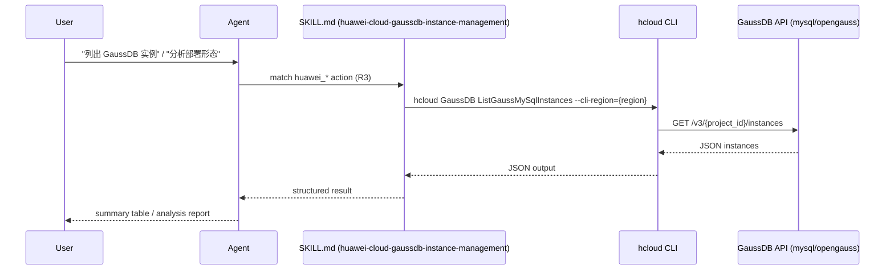
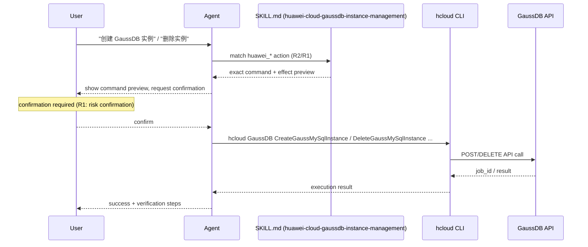

# Data Flow Diagram

## Query / Analyze (R3 — read-only, auto-execute)

## Manage (R2/R1 — preview + confirm)

## Key facts carried through the flow

- **Product family** (MySQL-compatible vs openGauss) is selected first and routes the service name (`GaussDB` vs `gaussdbforopengauss`).
- **Critical Warnings** are surfaced at the preview step for R2/R1 actions: shard key permanent, ≥3 nodes minimum, engine version pinned.
- **Quality reporting** is documented for every execution via the SKILL.md Quality Reporting section (skill_quality_sdk.py integration, non-blocking).