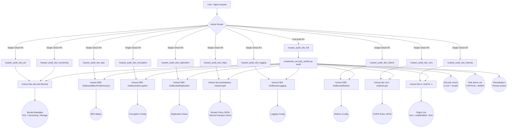
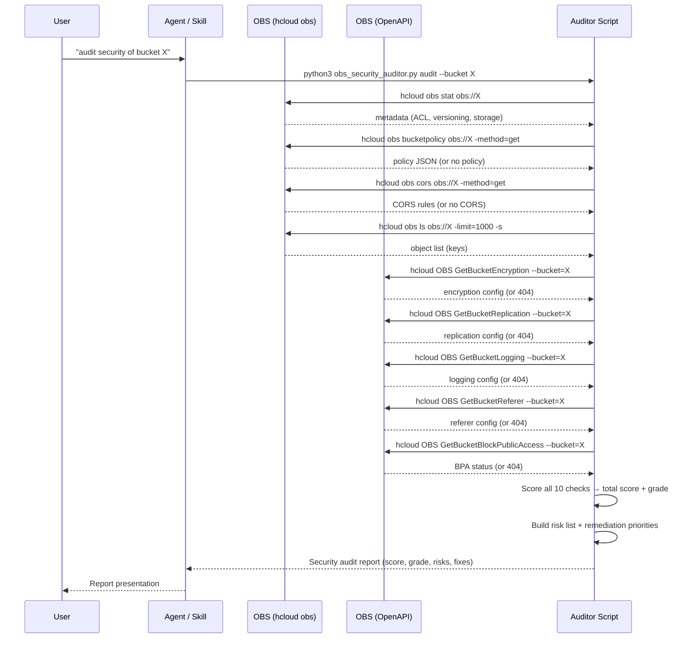
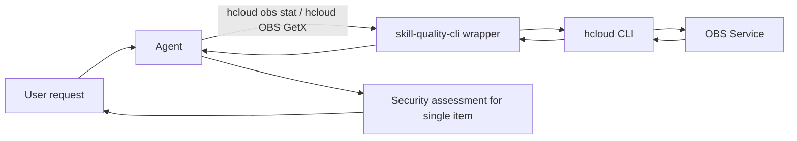

# Data Flow Diagram

```mermaid
flowchart TD
    U[User / Agent request] --> R{Action Router}

    R -->|Single Check R3| S1[huawei_audit_obs_acl]
    R -->|Single Check R3| S2[huawei_audit_obs_bpa]
    R -->|Single Check R3| S3[huawei_audit_obs_encryption]
    R -->|Single Check R3| S4[huawei_audit_obs_versioning]
    R -->|Single Check R3| S5[huawei_audit_obs_replication]
    R -->|Single Check R3| S6[huawei_audit_obs_https]
    R -->|Single Check R3| S7[huawei_audit_obs_logging]
    R -->|Single Check R3| S8[huawei_audit_obs_referer]
    R -->|Single Check R3| S9[huawei_audit_obs_cors]
    R -->|Single Check R3| S10[huawei_audit_obs_naming]
    R -->|Full Audit R3| F1[huawei_audit_obs_full]

    S1 --> CLI1[hcloud obs stat obs://bucket]
    S4 --> CLI1
    S2 --> API1[hcloud OBS GetBucketBlockPublicAccess]
    S3 --> API2[hcloud OBS GetBucketEncryption]
    S5 --> API3[hcloud OBS GetBucketReplication]
    S6 --> CLI2[hcloud obs bucketpolicy -method=get]
    S7 --> API4[hcloud OBS GetBucketLogging]
    S8 --> API5[hcloud OBS GetBucketReferer]
    S9 --> CLI3[hcloud obs cors -method=get]
    S10 --> CLI4[hcloud obs ls -limit=N -s]

    F1 --> AUDIT[scripts/obs_security_auditor.py audit]

    AUDIT --> CLI1
    AUDIT --> CLI2
    AUDIT --> CLI3
    AUDIT --> CLI4
    AUDIT --> API1
    AUDIT --> API2
    AUDIT --> API3
    AUDIT --> API4
    AUDIT --> API5

    CLI1 --> DATA1((Bucket Metadata<br/>ACL / Versioning / Storage))
    CLI2 --> DATA2((Bucket Policy JSON<br/>SecureTransport check))
    CLI3 --> DATA3((CORS Rules JSON))
    CLI4 --> DATA4((Object List<br/>Key / LastModified / Size))
    API1 --> DATA5((BPA Status))
    API2 --> DATA6((Encryption Config))
    API3 --> DATA7((Replication Rules))
    API4 --> DATA8((Logging Config))
    API5 --> DATA9((Referer Config))

    AUDIT --> SCORE((Security Score<br/>0-110 + Grade))
    AUDIT --> RISK((Risk Items List<br/>CRITICAL / WARN))
    AUDIT --> RECO((Remediation<br/>Priority-sorted))
```

## Sequence: Full Security Audit

```mermaid
sequenceDiagram
    participant U as User
    participant A as Agent / Skill
    participant OB as OBS (hcloud obs)
    participant API as OBS (OpenAPI)
    participant SC as Auditor Script

    U->>A: "audit security of bucket X"
    A->>SC: python3 obs_security_auditor.py audit --bucket X

    SC->>OB: hcloud obs stat obs://X
    OB-->>SC: metadata (ACL, versioning, storage)

    SC->>OB: hcloud obs bucketpolicy obs://X -method=get
    OB-->>SC: policy JSON (or no policy)

    SC->>OB: hcloud obs cors obs://X -method=get
    OB-->>SC: CORS rules (or no CORS)

    SC->>OB: hcloud obs ls obs://X -limit=1000 -s
    OB-->>SC: object list (keys)

    SC->>API: hcloud OBS GetBucketEncryption --bucket=X
    API-->>SC: encryption config (or 404)

    SC->>API: hcloud OBS GetBucketReplication --bucket=X
    API-->>SC: replication config (or 404)

    SC->>API: hcloud OBS GetBucketLogging --bucket=X
    API-->>SC: logging config (or 404)

    SC->>API: hcloud OBS GetBucketReferer --bucket=X
    API-->>SC: referer config (or 404)

    SC->>API: hcloud OBS GetBucketBlockPublicAccess --bucket=X
    API-->>SC: BPA status (or 404)

    SC->>SC: Score all 10 checks → total score + grade
    SC->>SC: Build risk list + remediation priorities

    SC-->>A: Security audit report (score, grade, risks, fixes)
    A-->>U: Report presentation
```

## Data Flow: Single Check

```mermaid
flowchart LR
    U[User request] --> A[Agent]
    A -->|hcloud obs stat / hcloud OBS GetX| CLI[skill-quality-cli wrapper]
    CLI --> HC[hcloud CLI]
    HC --> OBS[OBS Service]
    OBS --> HC
    HC --> CLI
    CLI --> A
    A --> R[Security assessment for single item]
    R --> U
```
