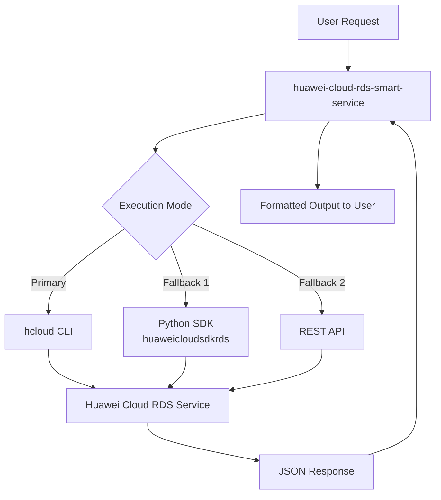
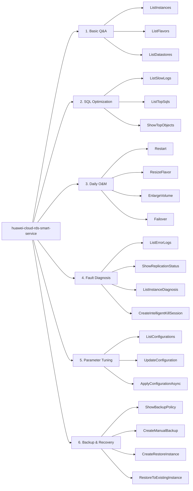
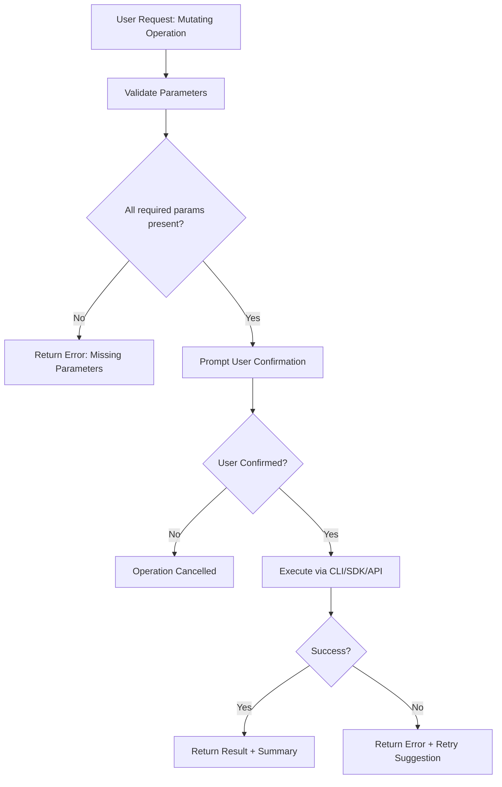
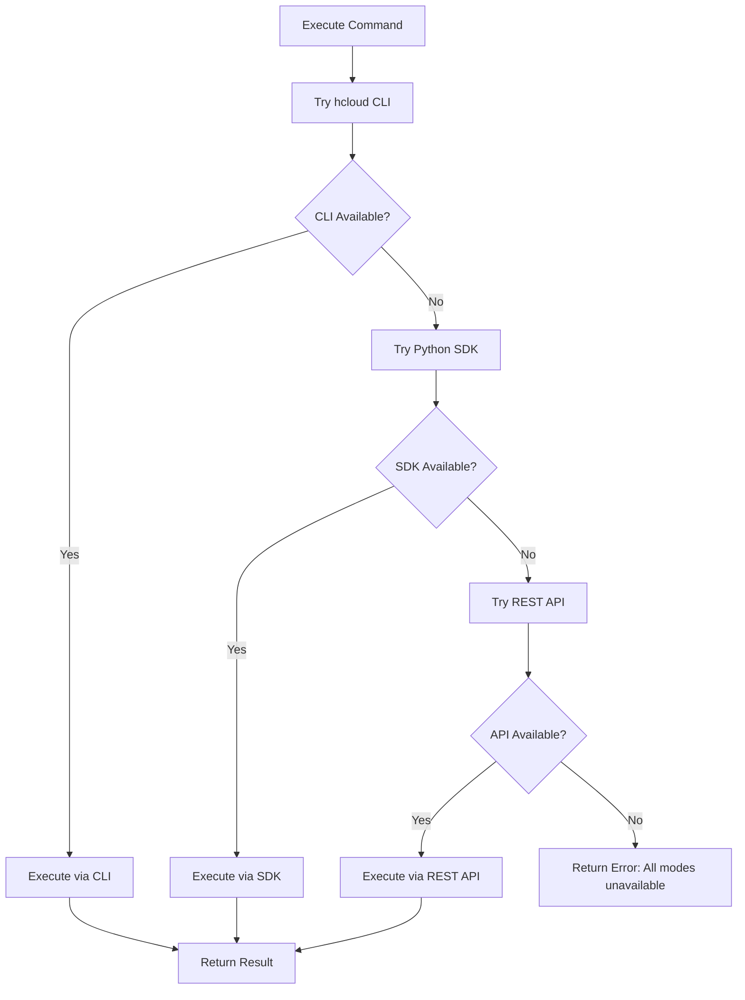

# Dataflow Diagram

## Overall Architecture

```mermaid
flowchart TB
    User[User Request] --> Skill[huawei-cloud-rds-smart-service]
    
    Skill --> Mode{Execution Mode}
    
    Mode -->|Primary| CLI[hcloud CLI]
    Mode -->|Fallback 1| SDK[Python SDK<br/>huaweicloudsdkrds]
    Mode -->|Fallback 2| API[REST API]
    
    CLI --> RDS[Huawei Cloud RDS Service]
    SDK --> RDS
    API --> RDS
    
    RDS --> Response[JSON Response]
    Response --> Skill
    Skill --> Output[Formatted Output to User]
```

## Capability Domains

```mermaid
flowchart LR
    Skill[huawei-cloud-rds-smart-service]
    
    Skill --> D1[1. Basic Q&A]
    Skill --> D2[2. SQL Optimization]
    Skill --> D3[3. Daily O&M]
    Skill --> D4[4. Fault Diagnosis]
    Skill --> D5[5. Parameter Tuning]
    Skill --> D6[6. Backup & Recovery]
    
    D1 --> D1a[ListInstances]
    D1 --> D1b[ListFlavors]
    D1 --> D1c[ListDatastores]
    
    D2 --> D2a[ListSlowLogs]
    D2 --> D2b[ListTopSqls]
    D2 --> D2c[ShowTopObjects]
    
    D3 --> D3a[Restart]
    D3 --> D3b[ResizeFlavor]
    D3 --> D3c[EnlargeVolume]
    D3 --> D3d[Failover]
    
    D4 --> D4a[ListErrorLogs]
    D4 --> D4b[ShowReplicationStatus]
    D4 --> D4c[ListInstanceDiagnosis]
    D4 --> D4d[CreateIntelligentKillSession]
    
    D5 --> D5a[ListConfigurations]
    D5 --> D5b[UpdateConfiguration]
    D5 --> D5c[ApplyConfigurationAsync]
    
    D6 --> D6a[ShowBackupPolicy]
    D6 --> D6b[CreateManualBackup]
    D6 --> D6c[CreateRestoreInstance]
    D6 --> D6d[RestoreToExistingInstance]
```

## Mutating Operation Flow

```mermaid
flowchart TB
    Request[User Request: Mutating Operation] --> Validate[Validate Parameters]
    Validate --> Check{All required params present?}
    Check -->|No| Error[Return Error: Missing Parameters]
    Check -->|Yes| Confirm[Prompt User Confirmation]
    Confirm --> Confirmed{User Confirmed?}
    Confirmed -->|No| Cancel[Operation Cancelled]
    Confirmed -->|Yes| Execute[Execute via CLI/SDK/API]
    Execute --> Result{Success?}
    Result -->|Yes| Success[Return Result + Summary]
    Result -->|No| Retry[Return Error + Retry Suggestion]
```

## Three-Level Fallback

```mermaid
flowchart TB
    Start[Execute Command] --> TryCLI[Try hcloud CLI]
    TryCLI --> CLIOk{CLI Available?}
    CLIOk -->|Yes| CLIExec[Execute via CLI]
    CLIOk -->|No| TrySDK[Try Python SDK]
    
    TrySDK --> SDKOk{SDK Available?}
    SDKOk -->|Yes| SDKExec[Execute via SDK]
    SDKOk -->|No| TryAPI[Try REST API]
    
    TryAPI --> APIOk{API Available?}
    APIOk -->|Yes| APIExec[Execute via REST API]
    APIOk -->|No| Fail[Return Error: All modes unavailable]
    
    CLIExec --> Done[Return Result]
    SDKExec --> Done
    APIExec --> Done
```
